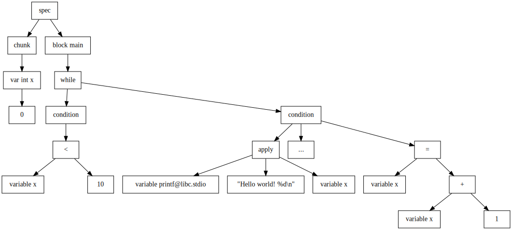
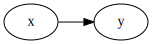
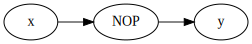

# Abstract

TODO

# Introduction

TODO

- Explain context of CTF competitions
- Explain automatic flag generation
- Explain the broad strokes design and differences of this approach to other
  approaches

## Problem statement

The current process for building Capture the Flag competitions specifically in
the context of binary exploitation and reverse engineering challenges, is
highly manual, requiring careful and painstaking work to produce interesting,
different and challenging puzzles. Despite the effort, however, the output of
this design is often a single challenge binary, with only a single solution.

This binary suffers from a lack of exploitation variety, leading to an
increased opportunity for CTF players to illegally share solutions. Some
significant effort has been made to prevent this form of cheating, preventing
flag-sharing by randomizing flags, and has shown successful results - however,
some cheating may still go unnoticed, due to the more complex "solve-sharing",
in which players share detailed writeups or solve scripts with each other,
allowing them to gain different flags, but using the same technique. We want to
provide a way to mitigate against this more advanced form of cheating.

Additionally, the binary only represents a single challenge - an interesting
puzzle can only be solved once, and not over and over again. By introducing a
high level of random variation into the challenge as part of it's design and
build process, we can output multiple challenge binaries, with slightly
different solutions. This allows players to practice a single technique
multiple times, to enhance understanding of the underlying concepts.

Finally, we want to create an environment for a challenge designer to
efficiently and easily create new binary challenges, at a higher level than
manually writing C code. Ideally, such an environment would allow for easy
construction of vulnerable primitives, such as specifying memory layouts and
general control flow, while providing a level of abstraction over writing plain
C code.

## Related work

TODO

- What already exists?

## Report Overview

TODO

# Design

To solve the problems above, we present `vulnspec`, a new programming language
that encodes specifications of vulnerable programs, and command line utility to
interface with it. As vulnspec shares many similarities with low-level systems
languages, as it is transpiled to C.

As opposed to other prior work in binary challenge generation, such as AutoCTF [],
we take a completely new top-down approach, which is inspired by the
configuration of SecGen [] used to create vulnerable virtual machines. Instead
of taking working programs and modifying them to contain vulnerabilities, we
take a vulnerability description and produce a program that contains that
vulnerability, generating the surrounding context as neccessary.

We take the view that the actual mechanics of the program are less important
than the vulnerability that the program expresses. This allows a challenge
designer to focus on creating a specification that details the vulnerabilities,
without worrying about the surrounding context.

## Goals

The `vulnspec` language and tooling has been built to satisfy a number of
design goals, that have been criticial in choosing which functionality to
prioritize building and implementing.

In deciding these goals, we consider three main parties: the challenge
designer (who creates the challenge), the challenge solver (who solves
challenges for points or academic marks), and the competition organizer (who
oversees the process, awards points, and distributes challenges to players).

The challenge creator should be able to:

- Encode stack overflow and format string exploits by detailing
  abstract memory layouts in the spatial domain.
- Encode heap exploits and race conditions by defining control flow over the
  abstract temporal domain.
- Be able to encode all standard C expressions and statements, either in
  `vulnspec`, or in C directly.

Then, the challenge solver should:

- Not be able to use their exact solve techniques, such as a script, on a
  challenge from the same challenge spec, but with a different random seed.
- Likewise, both challenges should appear visually different, with different
  program structure, variable names, etc.

Finally, the competition organizer (or in an academic setting, a module lead)
should be able to:

- Automatically check that generated challenges are solvable.
- Be able to easily deploy and deliver challenges to players, in some standard
  form, or as part as a larger system, such as a VM.

## Stages

To go from the raw text specification to final artifacts, we move through a
number of discrete stages of processing. These stages move from a low-level
representation of the specification, to a high-level, programmatic view,
finally producing low-level C code as an output.

The 6 stages are:

- **Parsing** to produce an Abstract Syntax Tree
- **Type checking** to sanity check that the Abstract Syntax Tree is somewhat
  semantically valid
- **Translation** to an Abstract Syntax Graph, referred to as the block-chunk
  graph
- **Interpretation** to remove and transform all blocks
- **Code generation** to produce final C code
- Optional **environment construction** to produce binaries and docker
  containers

Aside from these core stages, a number of smaller minor operations and
debugging steps are also performed in-between them, to provide additional
smaller pieces of functionality that are only really possible to achieve at
that exact level of representation.

## Specification

Vulnspec is designed to a minimal programming language that can express
vulnerabilities. As such, it's syntax mirrors C, however, there are a number of
high level constructs that C doesn't have.

### Blocks and Chunks

Blocks and chunks are the highest level constructs in the specification which
represent pieces of code and data respectively.

A block is essentially a procedure - additionally, it can't take any arguments
or return values, it just represents code that is executed.

```
block foo {
  // lines of code go here...
}
```

Blocks can call each other, forming a call graph. This isn't limited to just a
directed acyclic graph, blocks can call each other, and form co-recursive
structures.

```
block first {
  puts@libc.stdio("1. execute before call")
  call second
  puts@libc.stdio("3. execute after call")
}

block second {
  puts@libc.stdio("2. this is in the call")
}
```

In scenarios like this one, where a block is only referenced by one other
block, we can use an implicit block split, with an improvement in readability.
This results in the exact same block-chunk graph later in the pipeline, as the
splits are removed are translated into calls directly.

```
block first {
  puts@libc.stdio("1. execute before call")
  ...
  puts@libc.stdio("2. this is in the call")
  ...
  puts@libc.stdio("3. execute after call")
}
```

A chunk is a grouped collection of variable declarations. During the process of
synthesis, vulnspec keeps these variable declarations together, so that they
are next to each other in memory, in the same order that they are declared in.

```
chunk x : [64]char,  // if x overflows...
      y : int        // ...then it overflows into y!
```

A program can define as many chunks as it likes, although vulnspec only
guarantees proximity for variables placed into the same chunk.

Additionally, both blocks and chunks can contain a number of constraints, which
enforce an interpretation, or somehow dictate how vulnspec should treat the
block or chunk later on through the pipeline.

```
chunk (global) a : int
chunk (local) b : int
chunk (static) c : int

block (inline) f {
}
block (func) g {
}
```

In the above:

- `a` is forced to be a global variable, and to appear in either the `.data` or
  `.bss` section of the binary
- `b` is forced to be a local variable, and to appear as part of a stack frame
- `c` will be only initialized once, no matter whether it is local or global
- `f` is forced to be inlined into all blocks that call it
- `g` is forced to be a separate function, and function called by all blocks
  that call it

See **[Interpretation](#interpretation)** for more information on
constraint resolution, removal of chunks and blocks, and translation into
C-style primitives.

### Statements

To actually specify behaviour in the specification, blocks can contain any
number of statements.

Vulnspec is actually kept fairly minimal in the number of different types of
statements it offers:

| Statement | Description |
| :-------- | :---------- |
| Call | Transfer execution control to another block, and return control to the current block after it finishes. |
| If | Conditionally execute a series of statements based on a boolean expression. |
| While | Repeatedly execute a series of statements based on a boolean expression. |
| Assignment | Assign the value of an expression to an lvalue, such as a variable, dereferenced pointer or array cell. |
| Expression | Determine the value of an expression, throwing away the result at the end, effectively relying on the side-effects of the expression. |

### Expressions

Expressions are vital to expressing any of the above statements. Essentially an
expression is a way of combining separate individual raw values and variables
together to yield a computed result. This result may be `void`, as in the case
of a statement that only calls a `void` function, but can be any type of value
that can be defined in the language.

These expressions can be used purely for their side effects, such as with an
expression statement, or may be stored in an lvalue, a minimal subset of
expressions that define values that can be assigned to.

At the core of the expressions, we have variables, as well as literal values,
such as `1` or `"Hello, world"`. All the different types of values available
are shown in the following table:

| Value type | Description |
| :--------- | :---------- |
| `int`      | An integer represented as a series of digits, with a base |
| `float`    | A floating point number represented as a whole number and a fractional part |
| `char`     | A single character as an integer in a byte |
| `string`   | A series of characters |
| `bool`     | A boolean value, either `true` or `false` |
| `template` | A value calculated from a python snippet, see **[Templates](#templates)** |

Additionally, we have a special kind of literal value, which are C-literals.
Because vulnspec is limited in the types of expressions and statements that it
offers, it may be useful to insert snippets of actual C code into it, for
example, to call a macro, which are not supported by vulnspec directly.

```
include "math.h"

block calc {
  printf@libc.stdio("area of circle with radius 5.0: %f", $(M_PI) * 5.0 * 5.0)
}
```

This block uses the `M_PI` value defined in the `math.h` header. Note that in
this case we have to explicitly include the header, while normally we don't
have to. For more information, see **[External Library Integration](#external-library-integration)**.

### Grammar

A simple annotated EBNF grammar is defined below:

```
(* a specification is a series of high-level pieces *)
spec = { piece }
piece = chunk_piece | block_piece | template_piece | include_piece

(* a chunk defines variables *)
chunk_piece = ("extern" | "chunk"), declaration, { ",", declaration }
declaration = name, ":", type, [ "=", expression ]
type =
     | "*", type
     | "[", (integer | template), "]", type
     | "fn", "(", args, ")", type
     | name

(* a template pre-defines templates without inserting values *)
template_piece = "template", template
template = "<", name, [ ";", ? python expression ? ], ">"

(* an explicit include requires that a certain header is included *)
include_piece = "include", string

(* a block contains statements *)
block_piece = "block", constraints, scope
scope = "{", statements, "}"
statements = { statement }

statement = "..."
          | while_statement
          | if_statement
          | call_statement
          | assignment
          | literal
          | expression
while_statement = "while", "(", expression, "), scope
call_statement = "call", name
if_statement = "if", "(", expression, ")", scope, [ "else", scope | if_statement ]
assignment = lvalue, "=", expression

(* operations upon expressions *)
expression = disjunction
disjunction = conjunction | ( conjunction, "||", disjunction )
conjunction = comparison | ( comparison, "&&", conjunction )
comparison = sum | ( sum, ( "!=" | "==" | "<" | "<=" | ">" | ">=" ), sum )
sum = product | ( product, ( "+" | "-" | "&" | "|" | "^" ), sum )
product = standalone | ( standalone, ( "*" | "/" ), product )
standalone = [ "-" | "!" | "~" ], atom

(* most basic atomic expression *)
atom = atom', [ "(", args, ")" ], [ "as", type ]
atom' = "(", lvalue, ")"
      | "(", expression, ")"
      | "&", lvalue
      | "sizeof", "(", type, ")"
      | "sizeofexpr", "(", expression, ")"
      | value
      | lvalue

(* expression that can appear on the left-hand-side of an assignment *)
lvalue = lvalue', [ "[", expression, "]" ]
lvalue' = "(", lvalue, ")"
        | "*", atom
        | "null" | "NULL"
        | name
        | literal

(* core non-terminals *)
name = alpha_char, { alpha_char | decimal_digit }, ( "@", { alpha_char | decimal_digit | "."} )
literal = "$", "(", { all_chars - ")" }, ")"

args = [ expression, { ",", expression } ]

(* values *)
value = integer | float | char | string | boolean | template
integer = ("0x", hex_digit, { hex_digit })
        | ("0o", oct_digit, { oct_digit })
        | ("0b", binary_digit, { binary_digit })
        | (decimal_digit, { decimal_digit })
float = decimal_digit, { decimal_digit }, ".", { decimal_digit }
char = "#", all_printable_chars ?
     | "#", '"', all_chars, '"'
     | "#", "'", all_chars, "'"
string = '"', { all_chars - '"' }, '"'
       | "'", { all_chars - "'" }, "'"
boolean = "true" | "false"
```

# Implementation

In this chapter, we present how the above design goals and specification is
implemented to produce the vulnspec synthesis tool. The tool is implemented in
around 8000 lines of Python code, and includes a lexer and parser written from
scratch, a minimal type checking system, libc integration, randomization
procedures and final challenge generation and output.

The structure of this section mirrors the pipeline laid out in the **Stages**
section above, and moves from the plaintext vulnspec specification to the final
challenge binaries and environments.

## Lexical analysis and parsing

To perform any meaningful analysis of the specification, it first needs to be
parsed into an Abstract Syntax Tree. This process is broken into two pieces,
lexing and parsing.

To demonstrate, we'll follow an example specification through the parsing pipeline:

```
chunk x : int = 0
block main {
  while x < 10 {
    printf@libc.stdio("Hello world! %d\n", x)
    ...
    x = x + 1
  }
}
```

In the lexing stage, we break up the raw text input into a series of tokens, or
terminals, of which there are 38 distinct types. The problem of producing a
series of tokens is trivially broken down into producing a single token at a
position in the raw stream, and moving the position for the next token to be
read. Our algorithm then just becomes an iterative algorithm, repeating until
we reach the end of stream.

At this stage, we specifically only handle any language features that are
*regular*, those that can be matched by a regular expression, or what we use, a
Deterministic Finite Automaton. Among the more complex structures that we
handle are: skipping past comments, parsing strings, defining templates, and
defining a wide variety of unary and binary operators, many of which have
similar prefixes. For each individual atomic language feature, we produce a
token object, containing a type, a possible lexeme (which represents the data
read), and a position and length of the token (which are pretty-printing error
messages later if neccessary).

In our example:

```
<Reserved "chunk">, <Name "x">, <Colon>, <Name "int">, <Assign>, <Integer ["0", 10]>, <Newline>
<Reserved "block">, <Name "main">, <BraceOpen>, <Newline>
<Reserved "while">, <Name "x">, <CompareLT>, <Integer ["10", 10]>, <BraceOpen>, <Newline>
<Name "printf@libc.stdio">, <ParenOpen>, <String "Hello world! %d\n">, <Comma>, <Name "x">, <ParenClose>, <Newline>
<Ellipsis>, <Newline>
<Name "x">, <Assign>, <Name "x">, <Plus>, <Integer ["1", 10]>, <Newline>
<BraceClose>, <Newline>
<BraceClose>, <Newline>
<EOF>
```

In the parsing stage, we read tokens from the stream and attempt to form them
into nodes of a tree. To do this, we use a recursive-descent parser, which
expresses terminals in the language by consuming tokens from the token stream,
and non-terminals as functions which can consume terminals, or call other
non-terminals. In this way, the structure of the call graph of the parser
mirrors the structure of the produced AST.

The parser is almost (and initially was) an $LL(k)$ grammar, which allowed the
parser to be entirely predictive. Unfortunately, because of some of the
complexity of the language, it's not possible to easily define some of the
structures in the language entirely predictively and so some backtracking is
required. For example, when parsing an expression, it may end with an array
index - so we can attempt to parse that, but it may fail, and so we backtrack
to before we tried. Similarly, when attempting to parse a statement, there are
two possiblities, an lvalue on the left of an assignment, or an expression as
part of an expression statement. There's no way with $k$ steps of lookahead to
work out which one is which, so we try one, then the other, using backtracking.
It's certainly possible to reduce the current grammar to an $LL(k)$ one and so
allow parsing in linear time with predictive parsing, but since most
specifications are quite small, it felt like an unneccessary optimization, when
other features needed development.
graph
At the end of parsing, we produce an Abstract Syntax Tree for the entire
specification, which can now be traversed and manipulated in later stages.



## Type checking

After constructing an Abstract Syntax Tree from the original stream of data, we
need some way of semantically validating it, to ensure that the challenge
designer has not made mistakes that would cause problems in later stages (such
as using undeclared variables) or would generate invalid C code output (such as
declaring variables to be of a non-existant type). To perform this
verification on the tree, we use a simple type-checking system.

Essentially, we traverse the tree using a visitor pattern, at each level
returning a type up to the next level, which can then be checked against other
known types, or types derived from the AST in a similar way. For example,
during an assignment, the types of both sides are checked against each other
for compatibility, while an if statement will check that it's condition is
compatible as a boolean value.

However, because we are aiming for compatibility with the C type system, since
we are compiling to C, we can't create an entirely new type system from
scratch. In fact, due to the fact that the C type system is so complex, and
built upon decades of historical baggage, it's incredibly difficult to
replicate perfectly, specifically, the implicit type conversion and promotion
rules. As a result, we construct a minimal type model of how C performs it's
checks, and rely on explicit casts for cases that fall outside of more common
use cases.

Our type model can be described by defining two kinds of types - concrete
types, such as an integer `int` or a string `*char`, and abstract types, such
as `Integral` or `Pointer`, which we call "meta"-types. Between these two
kinds, we can establish a simple function that maps concrete types into their
respective abstract types. **more elaboration**

When checking for compatibility between two types, it's not sufficient
to check that a type is identical to another type, like in more strongly-typed
languages; instead we need to verify that a type can be used in the context of
another type. For example, in C, integers are effectively used as booleans,
pointers are used as integers, etc. To help express this, we construct a
directed meta-type graph, with the vertices as meta-types, and the edges as
valid implicit conversions:

{ width=50% }

Then, the question of compability simply becomes one of reachability, i.e. to
use type $A$ in the context of type $B$, the metatype of $B$ must be reachable
on a path reachable from the metatype of $A$.  Using this, we can define an
additional notion of type checking, called "fuzzy" typing. This technique
allows easily checking adding an integer to a float, and converting between
pointers, but requires extra thought when trying to perform unsafe operations,
like downcast from floats to ints, or converting integers back to pointers.

This graph is encoded in the `config.yaml` file for the builtins directory (and
shortened for succinctness):

```yaml
...
core:
  types:
    void:
      - void
    boolean:
      - bool
    integral:
      - signed char
      - unsigned char
      - char
      # and many more...
    floating:
      - float
      - double
      - long double
    complex:
      - float complex
      - double complex
      - long double complex
    pointer:
  typemap:
    boolean: [void, integral]
    integral: [void, floating]
    floating: [void, complex]
    pointer: [void, integral]
    complex: [void]
...
```

Beyond the explicit graph here, we additionally define a universal meta type,
which skips the reachability check entirely, always returning true; this type
can be assigned anything and used anywhere. This is the meta type that we use
for unknown meta types, such as with external library integrations. This type
isn't notated in the graph, since it's not defined as part of it, but rather as
an additional concept on top of it.

Note that the above graph is only a rough approximation of the C implicit type
system conversions, and could be made a lot more complete with the further
distinction between more types, such as differently sized types, or signed and
unsigned integers, etc. Additionally, a couple of checks cannot be expressed by
this graph easily:

- Arrays can be passed as arguments, but cannot be assigned to.
- Functions can never be directly assigned to, or passed around.

## External library integration

The vast majority of pwnable CTF challenges require some interaction with libc,
the C standard library, either for the utility functions, such as file
input/output and networking tools, or to exploit vulnerable functions such as
`system` or `gets`. While it would be feasible to integrate into libc using a
form of the C-language literals as detailed above, this would essentially
require the challenge designer to write C *and* vulnspec, without any form of
safety and sanity checks from type-checking.

As such, we provide a utility to generate listings of all functions, variables
and types in libc, which can then be referenced using a special syntax from
vulnspec specifications. This utility is bundled along with the
`builtin_generator` tool which is used to generate primitive types and the
metatype graph from the previous section.

In the `config.yaml` in the builtins directory, in addition to all the fields
already detailed, we introduce a `libraries` key which specifies information
relevant to parsing and loading data from as many libraries as we want -
however, for mostly practical reasons, we only include libc, however, this
approach could be extended to any number of third-party libraries.

```yaml
...

libraries:
  libc:
    root: "../musl-1.2.1"
    include:
      - ./include/
    include_paths:
      - ./obj/include/
      - ./arch/generic/
      - ./arch/x86_64/

...
```

Each field's purpose is shown below:

| field | purpose |
| :- | :- |
| `root` | location of library relative to the current directory |
| `include` | list of locations to search for header files |
| `include_paths` | list of locations to recursively search for included files |

Note that we use the more lightweight libmusl, as opposed to the more common
and frequently used glibc. We expected that libmusl would prove simpler to
programatically analyze, with fewer internal complex dependencies, and
empirical tests confirmed this. Since the process mostly only extracts the
public functions of the library, all results from libmusl are transferrable to
when we use glibc (which is what we use for testing).

The builtin generation process is fairly straightforward from the provided
data. Initially, we scan for common build autotools and makefile build scripts,
such as `configure` and `Makefile` respectively, which we run before continuing
to the next stage. For some libraries, this *might* not be required, however,
quite a number of more sophisticated and complex libraries automatically
generate header and source files which may need to be scanned in later stages.

Next, we recursively traverse all the specified `include` directories, looking
for `.h` header files, collecting them into a data structure as we go. As we do
this, we also open each header file, scanning for all it's includes using a
simple regular expression - the scanner then searches for this include in the
`include_paths` directories, adding it as a child of the top-level header if
found. Then we repeat this process, scanning this new file includes, looking
for those, etc.

This scanning process may seem needlessly complex, however, not all important
constructs in a header will be directly declared in that header. For example,
the `stdint.h` header does not actually include a definition of `uint8_t`,
instead loading it from an internal source - by recursively searching for that
source, we can find the true definition and implicitly connect it to `stdint.h`.

Once we have collected each header file, we can scan it. Initially, we
attempted an approach based on regular expressions - however, parsing even a
very small subset of C with this quickly becomes unwieldy. Therefore, we
switched to a `ctags` based approach, using Universal Ctags. As we run the
`ctags` program over each header file, we get back a list of tag objects which
represent variables, types and function declarations from that file, along with
their type signatures.

From these tags, we now translate each C-style name into a vulnspec-style name,
by appending `"@<lib>.<header-name>"` - e.g. `printf` becomes
`printf@libc.stdio`. We also translate each C-style type signature into a
vulnspec-style type, using a stack model (**More elaboration needed**). We can
then write these to JSON files, ready for use in processing specifications that
utilize libraries.

## Translation

Once the Abstract Syntax Tree has been checked and transformed, we can convert
it to a higher level representation, the block-chunk graph. In this
representation, instead of merely representing the low-level syntax of the
language, we more completely represent the relationships between individual
blocks and their calls, and chunks and their variables. Whereas in the AST we
represent calls and variable references simply by using their names, in the
block-chunk graph, we use actual pointers (or the Python equivalent) to show
the relationships.

This has enormous implications in how we can traverse the graph, easily
allowing defining complex operations such as structural traversals and
structural maps using recursion and first order functions. This introduced
complexity allows performing more complex operations such as interpretation,
described **later**.

To perform the translation process, vulnspec uses a similar visitor pattern to
during type checking. However, instead of returning a type labelling for each
node, we return a new node that has been translated. The domain and codomain of
this transformation are completely separate (except for explicitly labelled
types), and the nodes used to represent the block-chunk graph are similar but
unique to the ones in the tree. They are also, in a number of cases, simpler,
not encoding the complexity of different literal values, and simplifying some
nodes away into other constructs.

Most nodes have a one-to-one correspondence in the block-chunk graph, however,
a number of the translations are slightly more complex:

- Exact values are removed, and replaced with string representations, to what
  they will be output as in C code generation. Interpretation and other later
  stages don't require knowledge of individual values, so we can simplify it
  here. As part of this, templates will also be resolved.
- If statements are unwrapped from their tree-like recursive structure to a
  sequence which simplifies processing and code generation dramatically.
- Block splits are removed, and the block is split into two separate blocks,
  with the first one ending in calling the second. Since the later stages
  require lots of complex block processing, this simplifies needing to handle
  more cases.
- Constraints are resolved from raw string representations to a collection of
  enumerated values.

Aside from these edge cases, the transformation is relatively straightforward,
and prepares the internal representation for later stages of processing.

## Interpretation

One of the most complex aspects of the project is in how the high-level
abstract representation of the graph of blocks and chunks can be translated
down into low-level C primitives. Mechanically, this reduces to deciding where
in memory each chunk should be placed, and deciding the process by which each
block can be called. We call each collection of decisions an "interpretation",
the results of which are executed by an "interpeter" modifying the graph.

The output of this process is a new graph, represented by a "program" object,
which contains a collection of functions (with their own arguments, local
variables and statements), and a number of global variables and optional
external variables (only if the specification requires them).

As the process of interpretation moves from start to finish we translate from
the vulnspec-style block-chunk graph, into a graph that more closely represents
the to-be-generated C code. This translation isn't performed in one piece, and
instead in multiple small pieces that get it closer to the goal.

### Generation

The most important step in the interpretation process is to remove the concepts
of blocks and chunks almost entirely from the program. These are vulnspec
concepts, and do not translate nicely down into C code.

Block represent lines of code, and calls represent the relationship between
them, while chunks represent variables appearing next to each other in
sequence. For both these blocks and chunks, we define a number of
"interpretations" - essentially, a technique for translating them into lower
level C.

Blocks can be assigned:

- A function interpretation, where the block is translated to a function, and
  all calls to it are translated to function calls, or,
- An inline interpretation, where the block is removed entirely, and all calls
  to it are replaced with the contents of the block directly.

Chunks can be assigned:

- A local interpretation, where the chunk is allocated onto the stack of a
  function, or,
- A global interpretation, where the chunk is allocated into global memory.

Note that this list of interpretations is not neccessarily the maximum number
of possible interpretations. For example, it would be possible to define
another interpretation for chunks, e.g. heap allocated chunks, or a struct that
wraps all the individual variables together. This behaviour is not implemented
in vulnspec, however, the mechanisms for interpreting it would be very similar
to the details explained in this section.

The challenge designer can force one of the interpretations, using a block or
chunk constraint, as explained earlier in **somewhere**. If a constraint has
not been specified, then an interpretation is randomly selected. The only
exception here is the `main` block, which must always have a function
interpretation, since it is the entrypoint to the program, and so cannot appear
inline.

After all blocks and chunk have been assigned an interpretation, we can begin
to apply those through all statements in the specification. We do this in two
passes, to remove as much complexity as possible in the first pass to make the
the latter, more complex, pass easier to reason about. In the first pass, we
remove all calls to inline blocks, while in the second pass, we remove all
calls to function blocks.

### Inline call reduction

In the first pass, we attempt to remove all vulnspec-style calls that reference
blocks with an inline interpretation. By doing this, we simplify the process
for the next stage, since all remaining calls have function interpretations, so
the resulting code can make a number of assumptions that allow for a simpler
implementation.

To reduce the inline calls, we map over each statement in every block,
detecting if a call is made to an inline block. If it is, we replace it with a
group of statements, which are the mapped statements that make up the block it
references (this is slightly inefficient, since we might end up mapping a
statement twice, but it does ensure that there are no orphan inline calls).
This statement group is a construct only created by this specific portion of
the code, and essentially represents a collection of statements that should be
viewed as a series of lines of code - this is mainly provided to simplify the
process of defining a mapping function, so that the type can remain
$\text{Block} \to \text{Block}$.

However, it is possible in a number of edge cases that the above procedure
won't work entirely correctly. This is because the exact order that blocks are
visited in still matters despite the additional level of recursive mapping. If
a function block is modified as part of the above procedure, then other
function blocks that refer to this function block will still point to the old
version, not the new one, as a side-effect of using a more condensed graph
representation.

To resolve this issue, after mapping over every block completely, after all
stages, we "repair" all pointers by looking up the name of the block that they
expect to be pointing at, and directing it to the new, correct block.

After all this, all inline calls are correctly removed, and the next stage of
interpretation can begin.

### Function call reduction

In this next pass, we can now resolve all calls to the remaining blocks, those
that are assigned a "function" interpretation. At this stage, we don't create
the functions themselves, but simply compute what the calls to them should look
like. However, this is not as simple as the previous stage, we can't just
insert a call of the form `block()` - some number of arguments may need to be
passed!

The need for introducing function arguments occurs when a chunk that is used in
the block is assigned a "local" interpretation and is also accessed in some
other block that eventually (either directly or indirectly) calls to it.

For example, suppose that a block $x$ calls block $y$, which we can notate as
$x \rightarrow y$. If a variable $\alpha$ is declared in block $x$ as a local
variable, then for $y$ to access this variable, the call $x \rightarrow y$ can
be modified to pass $\alpha$ as a parameter. By performing this computation for
all variables, for all calls, we can compute the function signature of each
block, and so modify all the vulnspec block calls into function-style calls.

#### Rooting

To determine which function calls need to be patched with which parameters, we
first need to "root" each chunk, i.e. find a function block such that all
references to a chunk are contained in that block and it's descendants. We can
then add that chunk's variables to the collection of local variables (at a
later stage when we actually construct the function).

This process is essentially a variation of the lowest common ancestor problem
in graph theory. However, the usual techniques for calculating this are for trees
or directed acyclic graphs, which aren't sufficient for this problem since the
call graph may contain cycles through the expression of recursive or
co-recursive blocks.

A naive algorithm (and what we initially implemented) finds every block that
references a local variable, then computes all possible paths to that block.
After finding all the paths, the naive algorithm takes the common prefix of all
paths to find the "best" location to place a variable. This result will be
valid, however, as we show later with an example, it may not be optimal.

The more complex "deepest-valid" algorithm starts the same way, computing all
paths to a variable. Then, it finds the complete set of valid owners by finding
the set of all blocks that are present in all paths (since the root block has
to be present in every possible execution), removing those blocks which are
part of a cycle. Finally, the deepest of these blocks can be selected to be the
owner.

To see the difference in these algorithms, consider the following
specification, assuming that all chunks are local and all blocks are functions:

```
chunk a : int
chunk b : int
chunk c : int
chunk d : int
chunk e : int

block x {
  a = 0
  e = 4
  call y
  call z
}

block y {
  b = 1
  c = 2
  e = 4
  call z
}

block z {
  c = 2
  d = 3
  e = 4
}
```

By traversing the call graph, we can easily compute all paths to each variable.

- $a$ and $b$ are both referenced once, by $x$ and $x \rightarrow y$ respectively.
- $c$ is referenced by $x \rightarrow y$, $x \rightarrow y \rightarrow z$ and $x \rightarrow z$
- $d$ is referenced by $x \rightarrow y \rightarrow z$ and $x \rightarrow z$
- $e$ is referenced in all blocks by $x$, $x \rightarrow y$, $x \rightarrow y \rightarrow z$ and $x \rightarrow z$

The naive method, which computes the common prefixes of all paths will
correctly place $a$, $c$ and $e$ in $x$ and $b$ in $y$. However, it will
sub-optimally place $d$ into $x$, when it could be easily placed into $z$.

The deepest-valid algorithm correctly places $d$, by first detecting $x$ and
$z$ as valid locations for the variable, and then choosing the deepest of the
two.

Placing all the variables, we can compute the following:

- $a$, $c$ and $e$ can be only declared in $x$
- $b$ can be declared in $x$ or $y$, and so is declared in the deepest, $y$
- $d$ can be declared in $x$ or $z$, and so is declared in the deepest, $z$

#### Signature

With each chunk rooted, we can now easily find what each function signature
should be. For each function call between the root of a variable's chunk and
the same variable's usage, we need to pass that variable in the function call.

Intuitively, this works because based on the above rooting stage, we know that
each block that requires a variable will have access to it through an ancestor
block. Then inductively, we can show that a block with direct access to a
variable in its scope will pass access to that variable to all it's children
which it calls. Because of this, all descendants of the root block that need
access to the variable can get it!

Practically, the signatures of function calls can be constructed by iterating
through all paths to all variable (after skipping to the root), and patching
each call to also include the variable name that is needed at a lower level.

For example, for the variable $e$ above (rooted at $x$), from the path $x
\rightarrow y \rightarrow z$, we know that calls $x \rightarrow y$ and
$y \rightarrow z$ must contain $x$ as a parameter. Repeating this for all
variables and paths, we can create a full picture of all rooted variables and
the function signatures:

| Block | Parameters | Local variables |
| :- | :- | :- |
| $x$ | $()$ | $(a, c, e)$ |
| $y$ | $(c, e)$ | $(b)$ |
| $z$ | $(c, e)$ | $(d)$ |

### Parameter lifting

Unfortunately, the above description only covers half the story - it accurately
describes how to decide where in memory variables should be located, and how to
share access to them, however, using only this information, the function
signatures will be clearly incorrect.

For example:

```
chunk a : int

block x {
  a = 1
  call y
}

block y {
  a = 2
}
```

Using just the above algorithms, we can deduce that the function signature of
$y$ should be $\text{fn} \ (\text{int}) \ \text{void}$. However, since $y$
assigns to the variable $a$, this would only change a copy of $a$, instead of
the value of $a$ itself. To resolve this, we perform a process of "lifting",
which lifts simple variables into more complex l-value expressions, in this
case changing the function signature to accept a pointer to $a$, which allows
$y$ to modify the value correctly.

To lift a variable, we first recursively find all usages of that variable in a
block, and detect *how* it is used - for example, if it is dereferenced,
indexed into, referenced, etc.  Along with all the usual syntax defined
already, we also use a virtual reference, to refer to the usage of a variable
as an lvalue, since it requires a reference to the variable, but it still needs
to be dereferenced to use it, differently from a normal reference. All of these
instances of uses are all recorded as "usage captures", and collected together.

From the collection of usage captures, we can then determine the *maximal*
capture, i.e. a capture from which it is possible to derive the values of all
the other captures. For instance, a pointer to a variable can derive the value
of that variable, likewise, an array can derive all the values at each of it's
indices. Specifically, we want to find the *minimum* maximal capture, the
capture that only just allows derivation of all the other values, and doesn't
require extraneous access patterns.

...**diagram**..

To derive this maximal capture, we compare two usage captures trees at a time,
determining at each level what capture is required to allow deriving both of
the values. If we derive a type from this maximal capture, we can use that in
the function signature, since it represents the least-broad type needed to
derive all the uses of the variable.

All that's left now is to translate each usage capture within the block into a
new usage capture which correctly uses the new maximal in the function
signature to get the same value as before. To do this, we create an inverted
usage capture of the maximal which uses the new derived type of the maximal,
but every operation is inverted, so dereferences become references, etc. This
inversion essentially represents how one might get from the new maximal to the
raw value of the variable (however, it's likely nonsensical because it might
involve refs of refs, and other strange structures). However, we can take this
inversion, and put into each found usage capture in place of the old one. Then
we can simplify this new capture, by removing ref and deref pairs. Eventually,
we derive a new usage capture, which represents the new usage of the variable
within the signature of the function.

### Finalization

In the final stage, having translated all statements and expressions in each
block correctly, we can now translate the final remaining blocks into
functions. Since all calls have now been removed and replaced with new
statements, and all variable references have been fixed, all that's left to do
is to construct the functions themselves.

For each block, we can use the already-computed function signatures from
rooting and lifting to construct a list of arguments and their types. We can
also determine which local variables need to be assigned to each function so
that they appear in the right stack frame.

With all functions correctly defined, we can collect them along with all global
and external variables, into a program object, which represents the end product
of interpretation. This can then be traversed later during code generation to
produce fully valid and vulnerable C code!

## Randomization

An important aspect of vulnspec is to allow generating different programs that
all contain the same described vulnerability. While during the interpretation
process we introduce some randomness based on how we restructure the
block-chunk graph, these changes do not actually introduce major changes into
how the program actually runs, or the details of what an exploit might look
like.

To actually significantly semantically modify the output for a number of
outputs, we introduce a number of possible techniques, all of which have been
developed and implemented in vulnspec, however, it is by no means a complete
list of all the possible transformations that could be constructed.

Some of these techniques introduce surface level changes, such as the random
name generation, others introduce semantic difference in the program (and the
required exploit) such as templating, and others introduce both. Both of these
techniques are important together - generated programs must not only behave
slightly differently, and require different exploits for them, but they must
also look significantly different.

### NOPs

One of the most significant techniques for providing powerful randomization are
the introduction of No-Operation blocks (shortened to NOPs), which provide
variance across the temporal domain.

Essentially, each NOP block does nothing, except to provide some small
additional layer of complexity to the challenge. For example, the simplest NOP
is blank and does nothing at all, while some more complex NOPs introduce random
delays, or print out the value of a counter as a debugging log statement, or
introduce interesting comments into the code.

To add NOPs into the block-chunk graph, we traverse it, looking for vulnspec
calls. When we encounter one, with a random probability we alter it to instead
call a pre-defined NOP, and then for that new NOP block to call to the original
target. Note that at this point, interpretations have not been assigned, so
these could appear inline, or alternatively, as their own functions.





All NOPs are defined in the `vulnspec/data/nops/` folder, as individual blocks
with a `nop` constraint to mark that they should be parsed and be avaiable for
random selection. For example, a simple `log` NOP:

```
block (nop) log {
    puts@libc.stdio("[*] successful")
}
```

Introducing NOPs is slightly more complex than detailed above, especially when
the NOP makes references to other blocks, chunks or externs. To solve this,
when initializing the collection of NOPs, we traverse each NOP, exploring it's
connection to other blocks (including other NOPs, which is valid), as well as
it's variable references. Then, when we introduce a NOP into the block-chunk
graph, we also have to include all the blocks, chunks and externs that it
references.

### Templates

Templates are a powerful technique to modify parts of the program at
synthesization time, specifically over the spatial domain. Essentially, they
are abstract values that are not fixed, but take on a single concrete value for
a single synthesis. This instantiation of abstract to concrete values is
performed after parsing, but before translation into the block-chunk graph.

Each template has 2 components: a name, and an optional definition (note that
for the first usage of a template, the definition is not optional). In
vulnspec, they are written: `<Name; Definition>`, where `Name` is a valid
vulnspec name, and `Definition` is a Python expression. A templated value can
occur wherever a normal value might be expected.

During template instantiation, we traverse all the chunks, then all the blocks
in their order of declaration. When we encounter a template node, we evaluate
the Python expression and replace it with a `ValueNode` dependent on the type of
the result. For example, we replace a Python `int` with an `IntValueNode`, a
Python `str` with a `StringValueNode`, etc. If a template definition is not
provided, then we simply retrieve a cached result from a previously
instantiated template with the same name.

During template evaluation we provide a number of variables and functions to
more easily create complex expressions. In the global scope, we allow access to
a number of useful libraries (`random`, `string`, etc), as well as the
translations from vulnspec to C names. Meanwhile, in the local scope, we allow
referencing any already instantiated template values - this allows creating
template values that depend on the value of another template, a vital feature
in constructing vulnerable programs.

For example:

```
chunk buffer : [<Length; 32 * random.randint(1, 8)>]char
block foo {
  fgets@libc.stdio(buffer, <BadLength; Length + 1>, stdout@libc.stdio)
}
```

In the above, we randomly define the length of the `buffer`, and then use the
same value later to create a single NULL-byte overflow, which could be used as
part of an RCE exploit.

While templates are defined as abstract values, we can also use them inside C
literal expressions and statements, which allow us to perform complex randomization
inside parts of the program which cannot be defined in vulnspec due to the
limitations of the language.

To demonstrate, in the following specification, both block $x$ and $y$, will generate
equivalent outputs:

```
chunk a : int
block x {
  a = sizeof(uint8_t@libc.stdint)
}

block y {
  a = $(sizeof(<T; table.types["uint8_t@libc"]>))
}
```

### Random name generation

An important part of generating some level of variety between different output
results is generating new names for variables and functions - different names
will make the same program look different, even though they may be otherwise
identical. However, completely random names will appear nonsensical, and so to
prevent this, we use a Markov chain model based on existing libraries,
specifically the same `libmusl` as used to provide libc integration.

For our purposes, we define a Markov chain model as a mapping from $k$-length
strings to a weighted list of characters. From this, we can traverse over the
mapping, to produce a final word. The algorithm is described as follows:

- Initialize $s$ to the empty string
- Loop:
  - Take the $k$ last characters of $s$ (if the length of $s$ is less than $k$
    left-pad it with the empty character)
  - Look up the above suffix in the Markov chain mapping to a weighted list of characters
  - Randomly select a character $c$ from the weighted list.
    - If $c = \$$, the special end-of-word character, break the loop.
    - Otherwise, append $c$ to $s$ and continue the loop.
- Return $s$ as the generated name

Additionally, we also impose some minor sanity checks on the generated results,
to ensure that the length of outputs is in a desired range, that the same name
isn't generated twice, and that a name doesn't clash with one already defined
in an external library.

To generate names with this algorithm, we produce two separate models, one to
create variable names (of length in the range 1 - 12) and another to create
function names (of length in the range 3 - 12). The variable model is trained
on the global and local variable names in `libmusl`, while the function model
is trained on the function defintion and prototype names.

All strings $s$ that are generated by this algorithm have the useful feature
that every substring of length $k + 1$ in $s$ is present somewhere in a name in
the source content of libc. As the value of $k$ increases, the outputs become
increasingly similar to the source material, as shown in the following table

| $k$-value | Variables | Functions |
| :- | :- | :- |
| 1 | `k`, `rec`, `hufx`, `ignidxt`, `to` | `ndea`, `amsbysll`, `ffalifpy`, `lete_ake`, `strs` |
| 2 | `n`, `qq2`, `ts`, `b`, `r03` | `ify_wattrl`, `istente`, `inify`, `pthresub`, `xmktimemsgs` |
| 3 | `tmp`, `tls_tail`, `v5`, `wcs`, `test` | `weak_alias`, `ldir_r`, `sched_secmp`, `ctions_getln`, `isspawn_find` |

As we move towards higher values of $k$, the results become more and more
readable, and more similar to actual names that we would expect a programmer to
name variables and functions.

However, the issue now becomes picking a suitable value of $k$, one that it is
low enough to provide some variety, and high enough to enforce some sense of
consistency. To do this, we settle on an approach that allows us to select
*multiple* values of $k$, using what we call a "Multi" Markov chain model.

In this model, we create submodels for $k = 1$, $k = 2$, etc. up to $k = n$.
Then when generating a new character we randomly select a model using a
triangular distribution to weight towards where $k = \frac{n}{2}$. If we
discover that we can't find the suffix in the selected model, we continue to
select models until we can find the suffix.

As expected, this generates a combination of the results from above:

| Variables | Functions |
| :- | :- |
| `set`, `teol`, `i`, `o_by`, `st` | `systow10`, `isattroy`, `cog`, `undestach`, `fws` |

To generate the probabilities for this model, we use the same primitives for
extracting Ctags from `libmusl` as the builtin generator. Essentially we
iterate over each tag, counting the number of times that a $k$-length prefix
produces a given character. From this, we can produce a weighted list, and so
generate the model described above.

To optimize picking from the weighted list, instead of storing the individual
weight of each possibility, we store the cumulative weight of all possibilities
so far. This allows us to select randomly from the list using linear search in
$O(\log n)$ time, instead of the naive linear search which takes $O(n)$.

## Code generation

## Environments

At the end of the pipeline we produce valid, working C code that contains the
desired vulnerabilities. However, vulnerable C code by itself doesn't guarantee
exploitation, or even if it does, provide no details as to the difficulty of
producing a working exploit - these factors often down to compiler options,
kernel settings and the setup of the environment.

Therefore, to bridge this gap, we provide some additional utilities for
producing challenge binaries, suitable environments to run them in, and
automatic solution script generation to validate that the produced programs are
actually solvable.

These binaries and environments are created based on a variety of comment-based
configuration options. Defining these configuration options in the comments
clearly separates the process of program synthesis from the optional process of
generating valid environments.

These configuration options are allocated into 4 groups:

- Compiler settings
- Security settings
- Environment settings
- Additional files

These options are used across two phases, compilation and environment
generation.

During compilation, we use the configuration options to:

- Determine which compiler to use
- Decide which architecture to compile for (most frequently used to switch between 32
  and 64 bit)
- Decide whether to strip the final executable or not (to make for a harder
  reverse-engineering experience)
- Decide whether to generate debugging information
- Enable various security settings, such as NX protections, PIE executables,
  stack canaries and RELRO.

During environment generation, we use the options to:

- Create a system layout that allows for reading the flag on successful
  exploitation of the vulnerable program
- Automatically build a Dockerfile to generate a docker image for deployment

#### Compilation

In the optional compilation phase, the configuration options are used to create
a series of commands that when run in a usual Linux shell (and a standard set
of essential compiler software), will produce an exploitable binary.

By default, compiler options are added to suppress addition of useful security
protections, such as NX, PIE and RELRO. These options must manually be enabled,
essentially requiring the challenge designer to conciously make the challenge
more difficult by enabling new protections.

These build commands are prefixed to the file output as a C multiline comment,
to indicate how the file should be correctly compiled - if desired, this output
can be suppressed, and the file compiled manually. The vulnspec command line
tool additionally contains the `build` subcommand, which reads the build
commands from a synthesized C file and runs them automatically.

```c
/*
 * Generated by vulnspec.
 *
 * Build:
 > gcc -fno-zero-initialized-in-bss -fno-stack-protector -no-pie -z execstack -z norelro challenge.c -o challenge
 */
```

#### Environment

In the optional environment generation phase, the configuration options are
used to fully build a challenge binary, as well as output a Dockerfile for
building and hosting an environment in which the challenge can be successfully
run.

Docker is an open-source tool providing paravirtualization to deliver and run
applications along with their environments in fully complete *containers*
(**reference needed**). Each container is based off of an *image*, which are
built using commands from a Dockerfile. By having vulnspec output a Dockerfile,
we can create an easily replicable environment for CTF organizers and players
to run their challenges in, without having to deal with complex dependencies or
setups.

The setup of the image is rather typical, however, the process allows creating
a number of pre-defined setups for running the challenge binary. These setups
are identified by a 3-tuple `<access>-<interface>-<method>`.

The `access` determines how the challenge can be accessed, specifically:

- Over `tcp` (using a netcat forking server),
- Over `ssh` (using OpenSSH),
- Over `raw` (the challenge itself provides access mechanisms).

The `interface` determines how the challenge is interface with, specifically:

- By `shell` (the user is given a fully function Bash shell, with which they
  can perform many operations, including running the binary)
- By `raw` (the user interfaces directly with the challenge itself)

The `method` determines how the flag can be obtained:

- By `basic` (the flag can be found in a world-readable file at a known location)
- By `setuid` (the flag can only be read by a user that the challenge binary
  is setuid to)
- By `raw` (the challenge itself provides the flag)

To produce the image, the challenge is first built using the same mechanisms as
described in the Compilation section above. Then, a Dockerfile that contains a
pre-defined setup as well as specified ports and setup scripts can be created.

### Auto-solvers

Over a couple years of running and playing CTFs in academic settings, one of
the concerns that constantly emerges is the need to verify that challenges are
solvable. If a challenge is broken, it should be detected early on in the
development process, to allow the challenge designer time to amend it.
The widely accepted solution is to automate this, by requiring that all
challenges provide a solver script to automatically extract the flag from a
challenge so that verification is easy, and regressions can be tracked over time.

However, doing this with automatically generated challenges is difficult, and
is one of the main obstacles (**citation needed**) to deploying a system like
this in an academic setting. Challenges must all be solvable, and the
difficulty (by measuring the complexity of the solution) must remain *at least*
roughly the same, or the marks for the module will be skewed unfairly.

To resolve this, along with automatic challenge synthesis, we provide solution
script synthesis as part of environment generation. While it would be possible
to define a single solve script for each specification, that takes into
consideration all possible randomizations, writing such a script would be
unneccessarily quite challenging. Instead, we allow templating the script with
a number of special variables, with values known and derived during the
synthesis process, which are unavailable to challenge solvers.

These template values include:

- `gen_filename`, the filename of the challenge output
- `gen_names`, the translated names of blocks and variables
- `gen_templates`, the instantiated values of templates
- `gen_var_locations`, locations of variables (extracted from DWARF debugging
  data), which can be used to calculate exact offsets between variables

These challenge scripts can be run against the produced binaries to check that
they correctly output a flag - this is actually the same technique we used to
confirm the validitity of out example specifications.

These solution scripts have a number of uses: they could use to validate
synthesized challenges as explained above, they could be given as
individualized example solutions, or they could be used in a production setup
to continuously test that a challenge continues to work over time, improving
reliability.

# Results

TODO

No clue exactly what these will be yet.

# Conclusion

TODO

## Summary

TODO

## Evaluation

TODO

## Future work

TODO

- Automatic generation of NOPs from known secure code
- Integration into CTFd

# References

::: {#refs}
:::

# Appendices

## Appendix X (Command line help pages)
## Appendix X (Environment configuration options)
## Appendix X (Survey)

