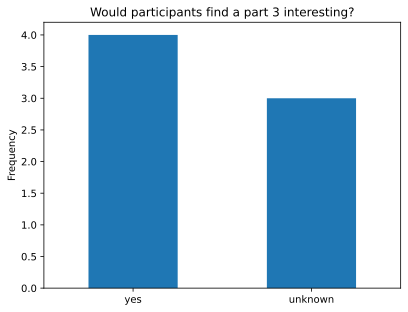

# Introduction

The field of computer security is a fairly recent invention, really only
brought to interest in 1967 with Willis Ware's paper Security and Privacy in
Computer Systems [@security-privacy]. Since then, computer security has been a
constant back-and-forth between attackers seeking to gain unauthorised access
to systems and defenders working to patch and protect those systems. However,
as the field has grown, the need for more security professionals, researchers
and students has grown, as the field itself has increased in scope and
complexity.

To provide a safe and moderated environment to practice and develop these
skills, Capture the Flag events have been introduced, in which the goal is to
obtain flags, i.e. "secrets hidden in purposefully-vulnerable programs or
websites." In these events, "competitors steal flags either from other
competitors (attack/defence-style CTFs) or from the organisers (jeopardy-style
challenges)" (Wikipedia [@wiki-ctf]). In these protected environments, hackers can explore
vulnerabilities, improving their skills and sharing their knowledge with the
community.

Additionally, the academic use of jeopardy-style CTFs for creating learning
environments has been extensively recognised, with inter-university
competitions such as C2C [@c2c], Inter-Ace [@interace] and its many spiritual
successors, such as HECC [@hecc], all attracting a wide array of industry
sponsorship and interest, including from government institutions. CTFs have
also seen use in classroom settings, both at the undergraduate level with
gamified exercises [@bham-vm2], and secondary school level with NCSC-supported
programs such as CyberFirst [@cyberfirst].

However, while CTFs have become more widespread, few innovations have changed
how they are fundamentally run -- while some software platforms for hosting
scoreboard software have been developed, very little effort has been made to
standardise the process by which challenges are developed and hosted. This
means that for every CTF, challenges must be painstakingly developed
one-by-one, with little ability to reuse challenges from previous competitions.
Cheating in the form of "flag-sharing" has also become an increasing cause for
concern (**citation needed**), with this allowing teams to gain unfair
advantages, or students to plagiarise results while remaining difficult to
detect by organisers.

One approach taken by many competitions is to introduce flag randomisation, so
that flags valid for one individual are not valid for others. Recent
innovations have led to the extension of this approach to introduce random
variation into the structure of the challenges themselves so that everyone
receives a unique copy, and challenges can even be reused between regular
competitions.

In this report, we present our take on challenge randomisation, specifically
concerning binary-focused challenges. We introduce `vulnspec`, a
Domain-Specific programming language with the ability to dictate memory layout
and control flow graph randomisation, allowing easy encoding of many
vulnerabilities. In this report, we explain both the design and implementation
decisions, as well as the technical details of our approach and evaluate our
success using a mini-CTF and survey.

## Problem statement

As previously stated, the current process for building Capture the Flag
competitions is highly manual, requiring lots of work to produce interesting
and varied challenges. Despite the effort, however, the output of this design
is often a single challenge binary, with only a single solution.

This binary suffers from a lack of exploit variety, leading to an increased
opportunity for CTF players to share solutions. Some effort has been made to
prevent this form of cheating, specifically by preventing flag-sharing through
flag randomisation. However, some cheating may still go unnoticed, due to more
complex "solve-sharing", in which players share detailed write-ups or
solve-scripts with each other, allowing them to gain different flags, but using
an identical technique. We want to provide a way to mitigate against this more
advanced form of cheating.

Additionally, the binary only represents a single challenge - an interesting
puzzle that can only be solved once and not over and over again. We want to
introduce random variation into the challenge as part of its design and build
process, so that we can output multiple challenge binaries, with different
solutions. This allows players to practice a single technique multiple times,
to enhance understanding of the underlying concepts.

Finally, we want to create an environment for a designer to easily and
efficiently create new challenges, at a higher level than manually writing C
code. Such an environment should allow for easy construction of vulnerable
primitives, such as specifying memory layouts and general control flow, while
providing a level of abstraction over writing plain C code.

## Related work

The area of automatic CTF challenge generation, despite being fairly
under-explored, mostly due to only recent interest in it, has several
interesting pieces of work in the field, many of which we draw inspiration
from.

The beginning of automatic challenge generation seems to lie with the 2014
edition of PicoCTF [@apg], where challenges were randomly templated to produce
different variations for different teams, reducing the ability of those teams
to share flags and solutions. This was effective throughout the competition and
allowed greater insight into who was cheating and how.

AutoCTF [@autoctf], a week-long event using challenges built using the LAVA bug
injection system [@autoctf-lava], is one of the most well-known tools for
automatic challenge generation. Their findings included that such a tool could
be (and was) used to massively reduce competition overhead and cost of
development by generating a wide variety of new challenges. However, because
the system was built upon bug-injection, ensuring that the results were
exploitable, or determining exactly the type of exploit that would be required
was quite difficult to do.

Contrasting with this bug-injection approach, there are specification-based
tools, such as SecGen [@secgen], which generate fully-fledged exploitable
virtual machines and create escalation pathways inside. Instead of varying
correct code and configs, templates are used to vary the setup of each VM, to
ensure that each player receives a different setup. Additionally, these
challenges are themed, providing a consistent "look-and-feel" to each VM,
emphasising the importance of non-surface level similarity.

Finally, Blinker [@blinker] creates randomised binary challenges using ERB ruby
templating of source files and LLVM integration to provide variation at the
binary level and uses these tools in a CTF competition to evaluate its success.
In particular, this technique has greatly inspired our work, however, the
design decisions and implementation differ substantially.

# Design

To solve the problems detailed above, we present `vulnspec`, a new
domain-specific programming language that encodes specifications of vulnerable
programs. Vulnspec can be interfaced with using a flexible command-line
interface or using a Python API. When run, it can produce C code, binaries and
runnable environments, ready for players to solve.

To do this, we take a top-down approach, inspired by the configuration of
SecGen and Blinker. We take a vulnerability description and produce a program
that contains that vulnerability, introducing variation around it.
Specifically, we extend the idea of simple templating to produce our own
language that compiles to C and create variation within the control flow graph
and memory layout, which often makes up the most complexity in designing
challenges.

## Goals

The `vulnspec` language and tooling has been built to satisfy several design
goals, that have been critical in choosing what functionality to prioritise
implementing. In these goals, we consider three main users: the challenge
designer, the challenge solver, and the competition organiser.

The challenge creator should be able to:

- Encode stack overflow and format string exploits by detailing
  abstract memory layouts over the spatial domain.
- Encode heap exploits and race conditions by defining control flow over the
  abstract temporal domain.
- Encode all standard C expressions and statements, either in `vulnspec`, or as
  C literals.

Then, the challenge solver should be able to:

- Observe distinct differences in challenges generated from the same
  specification.
- Solve a single challenge instance multiple times, to learn more about the
  showcased vulnerability.

Finally, the competition organiser (or in an academic setting, the module
leader) should be able to:

- Automatically check that generated challenges are solvable.
- Easily deploy and deliver challenges to players, in some standard format.

## Stages

To translate from the raw text specification into binary artifacts, we move
through a number of discrete stages of processing. These stages translate from
a low-level representation of the specification to a high-level, programmatic
view, finally producing low-level C code as an output.

Specifically,

- [**Parsing**](#parsing) to produce an Abstract Syntax Tree (AST)
- [**Type checking**](#type-checking) to check the AST's semantic validity
- [**Translation**](#translation) to an Abstract Syntax Graph (ASG), referred to as the block-chunk
  graph
- [**Interpretation**](#interpretation) to transform and remove all blocks and chunks
- [**Code generation**](#code-generation) to produce C code
- Optional [**environment construction**](#environments) to produce binaries and Docker
  containers

Aside from these core stages, several minor operations and debugging steps may
be performed in-between, to provide additional functionality and randomisation.

## Specification

In this chapter, we outline the important syntactical constructs within
vulnspec. As it is designed as a minimal language that can express
vulnerabilities, its syntax mirrors C in many places, therefore, we focus on
the main differences, not the similarities.

For a more detailed specification of the grammar, see [Appendix 1](#appendix-1).

### Blocks and Chunks

Blocks and chunks are the highest level constructs in the specification that
represent pieces of code and data respectively.

A block is essentially a procedure -- it can't take any arguments or return
values, it just represents code that is executed.

```
block foo {
  // lines of code go here...
}
```

Blocks can call each other, forming a directed call graph. This isn't limited
to an acyclic graph; blocks can call each other and even form recursive
structures:

```
block first {
  puts@libc.stdio("1. execute before call")
  call second
  puts@libc.stdio("3. execute after call")
}

block second {
  puts@libc.stdio("2. this is in the call")
}
```

In scenarios like the one above, where a block is only referenced by one other
block, we can use an implicit block split. This is semantically equivalent in
the block-chunk graph later in the pipeline, where the two syntaxes are
reconciled.

```
block first {
  puts@libc.stdio("1. execute before call")
  ...
  puts@libc.stdio("2. this is in the call")
  ...
  puts@libc.stdio("3. execute after call")
}
```

To use variables, we group declarations into a collection called a chunk.
During synthesis, vulnspec keeps these declarations together, so that the
variables appear contiguously in memory, for example:

```
chunk x : [64]char,  // if x overflows...
      y : int        // ...then it overflows into y!
```

A specification can define as many chunks as it likes, however, proximity is
only guaranteed for variables placed into the same chunk.

Additionally, both blocks and chunks can contain constraints enforcing an
[interpretation](#interpretation) which dictates how vulnspec should treat the
block later in the pipeline.

```
chunk (global) a : int
chunk (local) b : int
chunk (static) c : int

block (inline) f {
}
block (func) g {
}
```

In the above example:

- `a` is forced to be a global variable, appearing in either the `.data` or
  `.bss` section of the binary
- `b` is forced to be a local variable, and to appear as part of a stack frame
- `c` will be only initialised once, no matter whether it is local or global
- `f` is forced to be inlined into all blocks that call it
- `g` is forced to be a separate function

With these high-level primitives, we can express all our important
relationships between code and data.

### Statements

To specify behaviour in the specification, blocks contain statements, and all
statements must appear in blocks. Vulnspec is kept fairly minimal with the
variety of statements it offers:

| Statement | Description |
| :-------- | :---------- |
| Call | Transfer execution to another block and return to the current block after it terminates. |
| If | Conditionally execute a series of statements based on a boolean expression. |
| While | Repeatedly execute a series of statements based on a boolean expression. |
| Assignment | Assign the value of an expression to an lvalue. |
| Expression | Evaluate an expression, discarding the result at the end, relying on its side-effects. |

### Expressions

Expressions are vital in most of the above statements. An expression is a way
of combining separate individual raw values and variables to yield a computed
result. This result may be `void`, as in the case of a statement that only
calls a `void` function, but can be any value that can be defined in the
language.

These expressions can be used purely for their side effects, such as with an
expression statement, or may be stored in an lvalue (a subset of expressions
that that can be assigned to) as part of an assignment, etc.

At the most basic, we have variables, such as $x$, and literal values, such as
`1` or `"Hello, world"`. For each literal value, we can assign a token type
from the following table:

| Value type | Description |
| :--------- | :---------- |
| `int`      | An integer represented as a series of digits, with a base |
| `float`    | A floating-point number represented as a whole number and a fractional part |
| `char`     | A single character as an integer in the range $(0, 255)$ |
| `string`   | A sequence of characters |
| `bool`     | A boolean value, either `true` or `false` |
| `template` | A value calculated from a python snippet, see **[Templates](#templates)** |

Additionally, we define C-literals, a special basic expression, allowing
insertion of C snippets directly into vulnspec. This can be used, for example,
to call a macro, which are not defined as builtins in the language.

```
include "math.h"

block calc {
  printf@libc.stdio("area of circle with radius 5.0: %f", $(M_PI) * 5.0 * 5.0)
}
```

The above uses the `M_PI` value defined in the `math.h` header. Note that, in
this case, we explicitly include the header, which normally would not be
required. For more information, see **[External Library Integration](#external-library-integration)**.

# Implementation

In this chapter, we demonstrate how the above design goals are implemented to
produce the vulnspec synthesis tool. The tool is implemented in around 8000
lines of Python code and includes a hand-written lexer and parser, a minimal
type-checking system, libc integration, various randomisation procedures and
a final challenge generator.

The structure of this chapter mirrors the pipeline laid out in the
**[Stages](#stages)** section above, moving through the pipeline from the
plain-text vulnspec specification to the final artifacts.

## Parsing

To perform any meaningful analysis of the specification, it needs to be parsed
into an AST. This process is broken into two pieces, lexical analysis and
parsing.

To demonstrate, we'll follow an example specification through parsing:

```
chunk x : int = 0
block main {
  while x < 10 {
    printf@libc.stdio("Hello world! %d\n", x)
    ...
    x = x + 1
  }
}
```

During lexical analysis, we break up the raw text input into a series of
tokens, or terminals, of which there are 38 distinct types. The problem of
producing a series of tokens is reduced to producing a single token from a
pointer into the text stream and then adjusting the position for the next
token. Our algorithm then becomes an iterative algorithm, repeating until we
reach the end of the stream.

For each individual language feature, we produce a token object, containing a
type, a possible lexeme (representing the data read), and the position and
length of the token.

From our example:

```
<Reserved "chunk">, <Name "x">, <Colon>, <Name "int">, <Assign>, <Integer ["0", 10]>, <Newline>
<Reserved "block">, <Name "main">, <BraceOpen>, <Newline>
<Reserved "while">, <Name "x">, <CompareLT>, <Integer ["10", 10]>, <BraceOpen>, <Newline>
<Name "printf@libc.stdio">, <ParenOpen>, <String "Hello world! %d\n">, <Comma>, <Name "x">, <ParenClose>, <Newline>
<Ellipsis>, <Newline>
<Name "x">, <Assign>, <Name "x">, <Plus>, <Integer ["1", 10]>, <Newline>
<BraceClose>, <Newline>
<BraceClose>, <Newline>
<EOF>
```

During parsing, we read tokens from the stream and form them into AST nodes.
For this, we use a recursive-descent parser, which expresses terminals in the
language by consuming tokens from the token stream, and non-terminals as
functions that can consume terminals, or call other non-terminals. In this way,
the structure of the call graph of the parser mirrors the structure of the
produced AST.

The parser is almost an $LL(k)$ grammar, which allowed the parser to be
entirely predictive. Unfortunately, because of the complexity of the language,
some of the structures in the language cannot be parsed predictively and so
some backtracking is required. For example, when parsing a statement, there are
two possible non-terminals -- an lvalue (on the left of an assignment), or an
expression (part of an expression statement). There's no way with $k$ items of
look-ahead to work out which one is which, so we can try one, then the other,
using backtracking.

At the end of parsing, we now have an AST, representing the entire
specification, which can now be programmatically later.


## Type checking

After constructing an AST from the original text stream, we need some way of
validating its semantics, to ensure that the challenge designer has not made
some mistake that could introduce problems later (such as calling an undefined
block) or would generate invalid C code (such as declaring variables to be of a
non-existent type). To perform this verification, we use a simple type-checking
system.

At its most basic, we traverse the tree using a visitor pattern, at each level
returning a type back up, which can then be checked against other known types,
or other types similarly derived from the AST. For instance, during an
assignment, the types of both sides are checked against each other for
compatibility.

However, because we are aiming for compatibility with the C type system, we
cannot introduce an entirely new type system. In fact, because the C type
system is so complex and built upon decades of historical baggage, it's
incredibly difficult to replicate perfectly, particularly regarding the
implicit type conversion and promotion rules. To avoid this, we construct a
minimal model of how C performs type checking to handle all but the most
complex cases.

Our type model defines two kinds of types - concrete types, such as an integer
`int` or a string `*char`, and abstract types, such as `Integral` or `Pointer`,
which we call "meta"-types. Between these two kinds, we establish a simple
function that maps concrete types into their respective abstract types,
manually defined in a `config.yaml`:

```
...
core:
  types:
    void:
      - void
    boolean:
      - bool
    integral:
      - signed char
      - unsigned char
      - char
      # and many more...
    floating:
      - float
      - double
      - long double
    complex:
      - float complex
      - double complex
      - long double complex
    pointer:
...
```

When checking for compatibility between two types, its not sufficient to check
that a type is identical to another type, like in strongly-typed languages;
instead, we need to verify that a type can be used in the context of another
type. For example, in C, integers are used as Booleans, pointers are used as
integers, etc. To help express this, we construct a directed meta-type graph
(also in the above config file), with the vertices as meta-types and the edges
as valid implicit conversions:

{ width=50% }

Then, the question of compatibility simply becomes one of reachability, i.e. to
use type $A$ in the context of type $B$, the meta-type of $B$ must appear in a
path originating from the meta-type of $A$. This technique allows checking most
safe operations, while requiring extra care when trying unsafe operations, like
down-casting from floats to ints.

Beyond the meta-type graph here, we additionally define a universal meta-type,
which skips the reachability check entirely, always returning true; this type
can be assigned anything and used anywhere. This is the meta-type that we use
when the meta-type is unknown, such as with external library integration. This
type isn't notated in the graph directly, since it's defined as an additional
abstraction on top.

Note that the above graph is only a rough approximation of the actual C type
system and could be made more complete with further distinction between types,
such as differently sized types, or signed and unsigned integers, etc.
Additionally, a couple of checks cannot be expressed by this graph easily, and
are encoding manually:

- Arrays can be passed as arguments, but cannot be assigned to.
- Functions can never be directly assigned to or passed around.

## External library integration

The majority of binary CTF challenges require interaction with the C standard
library (libc), either for utility functions, such as file input and output, or
to expose vulnerable functions such as `system` or `gets`. To better facilitate
such integration, we provide a utility to generate listings of all functions,
variables and types in specified libraries, which can then be referenced using
special syntax from vulnspec. This utility is bundled as the
`builtin_generator` tool which is also used to generate the primitive types and
the meta-type graph from the previous section.

In addition to the fields [already detailed](#type-checking) in the type config
file, we introduce a `libraries` key that specifies information relevant to
parsing and loading data from external libraries; for now, only libc is
included, but the approach is trivially extendable to other libraries.

```yaml
...
libraries:
  libc:
    root: "../musl-1.2.1"
    include:
      - ./include/
    include_paths:
      - ./obj/include/
      - ./arch/generic/
      - ./arch/x86_64/
...
```

Each sub-field's purpose is shown below:

| Field           | Purpose |
| :-------------- | :------ |
| `root`          | Library path relative to the current directory |
| `include`       | Locations to search for header files |
| `include_paths` | Locations to search for additional header files |

For our libc implementation, we choose libmusl, instead of the more frequently
used glibc. Because it is more lightweight, we expected that libmusl would
prove simpler to programmatically analyse, and empirical tests confirmed this.
Since the tool extracts all the data of the library, all results from libmusl
are transferable to when we use glibc for building challenges.

To generate builtins from these libraries, we first scan for common build
system scripts, such as `configure` and `Makefile`, which we run before
continuing to the next stage. While this may not be required for all libraries,
many complex libraries such as libc generate header and source files which need
to be scanned.

Next, we recursively traverse all the specified `include` directories,
collecting all `.h` header files. As we iterate through them, we open each one,
scanning for `#include` directives using a simple regular expression - the
scanner then searches for this path in the `include_paths` directories,
adding it as a child of the top-level header if found. Then we repeat this
process, scanning this new file's includes, looking for those, etc.

This scanning process may seem needlessly complex, however, it catches the edge
cases where definitions for a header are not directly declared in that header.
For example, the `stdint.h` header does not define `uint8_t` directly, instead,
loading it from an internal source. By recursively searching for that source,
we can find the true definition and connect it to `stdint.h`.

Once we have collected all header files and their links, we begin processing
using the Universal Ctags tool. As we run the `ctags` program over each header
file, we get back a list of tag objects which represent variables, types and
function declarations from that file, along with their type signatures.

From these tags, we translate each C-style name into a vulnspec-style name, by
appending `"@<lib>.<header-name>"` - e.g. `printf` becomes `printf@libc.stdio`.
We also translate each C-style type signature into a vulnspec-style type that
can be parsed using the vulnspec parser. These tag definitions are then written
to JSON files, ready for utilisation by the main `vulnspec` tool.

## Translation

Once the AST has been validated, it can be converted to a higher-level
representation, the block-chunk graph. In this representation, instead of
merely representing the low-level syntax of the language, we more completely
represent the relationships between individual blocks and their calls, and
chunks and their variables. Whereas in the AST we represent calls and variable
references simply by using their names, in the block-chunk graph, we use actual
pointers (or the Python equivalent) to show the relationships.

This has enormous implications in how we can traverse the graph, easily
allowing defining operations such as structural maps and traversals using
recursion and first-order functions. This introduced complexity allows
performing more complex transformations such as [interpretation](#interpretation).

To perform the translation process, vulnspec uses a similar visitor pattern to
the type checker. However, instead of returning a type labelling for each node
at each level, we return a new node that has been translated. The domain and
co-domain of this transformation are completely separate (except for explicitly
labelled types), and the nodes used to represent the block-chunk graph are
similar but unique to the ones in the tree. They are also, in a few cases,
simpler, not encoding the complexity of different literal values and
simplifying some nodes away completely.


Most nodes have a one-to-one correspondence in the block-chunk graph, however,
some of the translations are slightly more complex:

- Exact values are removed and replaced with string representations, to what
  they will be output as in C code generation. Interpretation and other later
  stages don't require knowledge of individual values, so they are simplified
  now. As part of this, templates are also resolved.
- If statements are unwrapped from their tree-like recursive structure to a
  sequence that simplifies processing and code generation dramatically.
- Block splits are removed and the block is split into two separate blocks,
  with the split location in the first replaced with a call to the second.
- Constraints are resolved from raw string representations to a collection of
  enumerated values, and checked for compatibility.

Aside from these edge cases, the transformation is relatively straightforward,
and prepares the internal representation for later stages of processing. The
final result is returned as an "asset", a collection of blocks, chunks and
associated data that has been completely validated.

## Interpretation

Most of the complexity of the synthesis process lies in how the high-level
abstract representation of the graph of blocks and chunks can be translated
down into low-level C primitives. Mechanically, this reduces to deciding where
in memory each chunk should be placed, and deciding the process by which each
block can be called. We call each set of these decisions an "interpretation",
the results of which are propagated by an "interpreter" into the graph.

The output of this process is a modified graph, represented by a "program"
object (rather than an asset) that contains a collection of global variables
and functions (with their own parameters, local variables and statements).

As the process of interpretation moves from start to finish we translate from
the vulnspec-style block-chunk graph, into a graph that more closely represents
the to-be-generated C code. This translation is broken up into multiple small
pieces that each get it closer to the goal, gradually propagating the results
outwards.

### Generation

The most important step in the interpretation process is to remove the concepts
of blocks and chunks from the program object. Blocks and chunks are both
vulnspec concepts and do not translate directly down into C code, so they must
be removed and replaced before code generation.

Block represent lines of code, calls represent the relationship between them,
while chunks represent variables appearing next to each other in sequence. For
both these blocks and chunks, we define a set of valid interpretations which
dictate how they can be translated into low-level C.

Blocks can be assigned:

- A function interpretation, where the block is translated to a function, and
  all calls to it are translated to function calls, or,
- An inline interpretation, where the block is removed entirely, and all calls
  to it are replaced with the contents of the block directly.

Chunks can be assigned:

- A local interpretation, where the chunk is allocated onto the stack of a
  function, or,
- A global interpretation, where the chunk is allocated into global memory.

Note that this list of interpretations is not necessarily the maximum number
of possible interpretations. For example, it would be possible to define
another interpretation for chunks, e.g. heap allocated chunks, or a struct that
wraps all the individual variables together. This behaviour is not implemented
in vulnspec, however, the mechanisms for interpreting it would be very similar
to the details explained in this section.

The challenge designer can force one of the interpretations, using a block or
chunk constraint, as explained earlier in **[Blocks and Chunks](#blocks-and-chunks)**.
If a constraint has not been specified, then an interpretation is randomly
selected. The only exception here is the `main` block, which must always have a
function interpretation, since it is the entry-point to the program, and so
cannot appear inline.

After all blocks and chunk have been assigned an interpretation, we can begin
to apply those through all statements in the specification. We do this in two
passes, to remove as much complexity as possible in the first pass to make the
the latter, more complex, pass easier to reason about.

### Inline call reduction

In the first pass, we attempt to remove all vulnspec-style calls that reference
blocks with an inline interpretation. By doing this, we simplify the process
for the next stage, since all remaining calls have function interpretations, so
the resulting code can make several assumptions that allow for a simpler
implementation.

To reduce the inline calls, we map over each statement in every block,
detecting if a call is made to an inline block. If it is, it is replaced with a
group of statements, which are the mapped statements that make up the block it
references (this is slightly inefficient, since we might end up mapping a
statement twice, but it does ensure that there are no orphan inline calls).

However, it is possible that in a few edge cases the above procedure won't work
entirely correctly. This is because the exact order that blocks are visited in
still matters despite the additional level of recursive mapping. Because of the
more condensed graph representation, if a function block is modified as part of
the above procedure, then other function blocks that refer to it will still
point to the older unmodified version, not the new one, as a side-effect of
using a more condensed graph representation.

To resolve this issue, after mapping over every block completely, after all
stages, we "repair" all pointers by looking up the name of the block that they
expect to be pointing at, instead directing it to the new, correct block.  With
this, all inline calls are correctly removed and the next stage of
interpretation begins.

### Function call reduction

In this next pass, we can now resolve all calls to the remaining blocks, those
that are assigned a function interpretation. At this stage, we don't create the
functions themselves, but simply compute what the calls to them should look
like. However, this is not as simple as the previous stage, we can't simply
insert a call of the form `block()`, as some number of arguments may need to be
passed.

The need for introducing function arguments occurs when a chunk is assigned a
local interpretation, but it is accessed in more than one block. For example,
suppose that a block $x$ calls block $y$, which we notate as $x \rightarrow y$.
If a variable $\alpha$ is referred to by both $x$ and $y$, then for $y$ to
access $\alpha$, the call $x \rightarrow y$ must be modified to pass
$\alpha$ as a parameter. By performing this computation over all variables, for
all calls, we can gradually compute the function signature of each block and so
modify all the vulnspec calls into function-style calls.

#### Rooting

Firstly, to determine which function calls need to be patched with what
parameters, we need to "root" each chunk, i.e. find a function block, called a
root, such that all references to a chunk are contained in that block and its
descendants. This chunk's variables then clearly belong to that function
block's stack frame.

This process is essentially a variation of the lowest common ancestor problem
in graph theory. However, the usual techniques for calculating this are for trees
or directed acyclic graphs, which aren't sufficient for this problem since the
call graph may contain cycles (through recursion).

A naive algorithm finds every block that references a local variable, then
computes all possible paths to those blocks. After finding all paths, the
algorithm extracts the common prefix of all paths to find the root location
to place a variable. This result will be valid, however, as we show later with
an example, it may not be optimal, and a "better" solution may be possible.

The more complex "deepest-valid" algorithm starts the same way, computing all
paths to a variable. Then, it computes the complete set of valid roots by
finding the set of all blocks that are present in all paths (since the root
block has to be present in every possible execution), additionally, removing
those blocks which are part of a cycle. Finally, the deepest of the remaining
roots can be selected to be the best root.

To see the difference in these algorithms, consider the following
specification, assuming that all chunks are local and all blocks are functions:

```
chunk (local) a : int
chunk (local) b : int
chunk (local) c : int
chunk (local) d : int
chunk (local) e : int

block (func) x {
  a = 0
  e = 4
  call y
  call z
}

block (func) y {
  b = 1
  c = 2
  e = 4
  call z
}

block (func) z {
  c = 2
  d = 3
  e = 4
}
```

By traversing the call graph, we can easily compute all paths to each variable.

- $a$ and $b$ are both referenced once, by $x$ and $x \rightarrow y$ respectively.
- $c$ is referenced by $x \rightarrow y$, $x \rightarrow y \rightarrow z$ and $x \rightarrow z$
- $d$ is referenced by $x \rightarrow y \rightarrow z$ and $x \rightarrow z$
- $e$ is referenced in all blocks by $x$, $x \rightarrow y$, $x \rightarrow y \rightarrow z$ and $x \rightarrow z$

The naive method, computing the common path prefixes, will correctly place $a$,
$c$ and $e$ in $x$ and $b$ in $y$. However, it will sub-optimally place $d$
in $x$, when it could be better placed into $z$.

The deepest-valid algorithm correctly places $d$, by first detecting $x$ and
$z$ as valid locations for the variable, then choosing the deepest of the
two.

Placing all the variables, we can compute the following:

- $a$, $c$ and $e$ can be only declared in $x$
- $b$ can be declared in $x$ or $y$, and so is declared in the deepest, $y$
- $d$ can be declared in $x$ or $z$, and so is declared in the deepest, $z$

#### Signature

With each chunk rooted, we can now compute each functions signature. For each
function call between the root of a variable's chunk and the same variable's
usage, we need to pass that variable in the function call.

Intuitively, this works because based on the above rooting stage, we know that
each block that requires a variable will have access to it through an ancestor
block. Then inductively, we can show that a block with direct access to a
variable in its scope can pass access to that variable to all its children
which it calls.

Practically, the signatures of function calls can be constructed by iterating
through all paths to all variables from the root, patching each call to include
the variable that is needed at a lower level.

For example, for the variable $e$ above (rooted at $x$), from the path $x
\rightarrow y \rightarrow z$, we know that the calls $x \rightarrow y$ and
$y \rightarrow z$ must contain $x$ as a parameter. Repeating this for all
variables and paths, we can create a full picture of all rooted variables and
the function signatures:

| Block | Parameters | Local variables |
| :---- | :--------- | :-------------- |
| $x$   | $()$       | $(a, c, e)$     |
| $y$   | $(c, e)$   | $(b)$           |
| $z$   | $(c, e)$   | $(d)$           |

### Parameter lifting

Unfortunately, while the above algorithm accurately describes how to decide
where in memory variables should be located and how to share access to them,
using only this procedure, the function signatures will still be incorrect.

To see this, we present the following example:

```
chunk (local) a : int

block (func) x {
  a = 1
  call y
}

block (func) y {
  a = 2
}
```

Following the above, we can deduce that the function signature of
$y$ should be $\text{fn} \ (a : \text{int}) \ \text{void}$. However, since $y$
assigns to the variable $a$, this would only change a copy of $a$; instead we
should pass a pointer to $a$, resulting in the signature $\text{fn} \ (a : *\text{int}) \ \text{void}$.

To resolve this, we perform a process of "lifting". This modifies expressions
from their old patterns of reference that assume a globally accessible
variable, to a new pattern of reference that properly accesses each variable
that has been made local by interpretation. In this case, this would change the
function signature to accept a pointer to $a$ and so allow changing 
the value correctly.

To lift a variable, we first recursively find all usages of that variable in
each block, detecting all the ways it is accessed, recording these as "usage
captures" and collecting them for later. Each of these captures record an exact
pattern of reference, such as if a variable is addressed (with the address-of
operator), dereferenced, or indexed into, as well as any compound of the above.
Along with these expression types, we also define an implicit "virtual"
reference, to refer to the usage of a variable as an lvalue, since it requires
a reference to the variable, but it still requires dereferencing later,
differently from a normal reference.

From the collection of usage captures, we can then determine the *maximal*
capture for each function block, i.e. a capture from which it is possible to
derive the values of all the other captures (including the ones in calls to
other functions). For instance, a pointer to a variable can derive the value of
that variable, likewise, an array can derive all the values at each of its
indices. Specifically, we want to find the *minimum* maximal capture, the
capture that only *just* allows derivation of all the other values and doesn't
require extraneous access patterns. In Figure \ref{fig:lift}, we can see that
the outermost items can derive the innermost items using common operators.

\begin{figure}[H]
  \begin{tikzpicture}
    \draw (1cm,1cm) rectangle (3cm, 3cm) node[midway]{$*x$};
    \draw (1cm,3.5cm) rectangle (3cm, 5.5cm) node[midway]{$x[\mathtt{idx}]$};
    \draw (-1cm,0.5cm) rectangle (3.5cm, 6cm) node[midway, xshift=-1.5cm]{$x$};
    \draw (-3cm,0cm) rectangle (4cm, 6.5cm) node[midway, xshift=-2.5cm]{$\&x$};
  \end{tikzpicture}
  \centering
  \caption{Lifting set diagram}
  \label{fig:lift}
\end{figure}

To derive the maximal capture, we can compare two usage captures trees at a
time (since they are subsets of expressions), determining at each level what
capture is required to allow deriving both of the values. Then we use this as a
first-order function in a *reduce* operation to calculate the maximal capture
over all the captures. Now, by traversing this final computed capture, we can
derive a type that is the correct one in the function signature, as it
represents the least-broad type needed to re-create all the usages correctly.

Finally, to complete the lifting process, we need to re-create each usage
capture a new capture that correctly uses the new maximal as a basis for
deriving the same result as before. To do this, we create an inverted usage
capture of the maximal that uses the new derived type of the maximal, but every
individual operation is inverted, so dereferences become references, etc. This
inversion essentially represents how one might get from the new maximal to the
raw value of the variable (however, its likely nonsensical because it might
involve refs of refs and other strange structures). However, we can take this
inversion and merge it into each found usage capture in place of the old
variable. Simplifying this capture, by removing ref and deref pairs, we derive
a new usage capture which represents the new usage of the variable within the
signature of the function.

\begin{figure}[H]
  \begin{tikzpicture}
    \draw[thin,gray!40] (-1,-1) grid (4,4);
    \draw[<->] (-1,0)--(4,0) node[right]{$x$};
    \draw[<->] (0,-1)--(0,4) node[above]{$y$};
    \draw[line width=2pt,blue,-stealth](0,0)--(1,3) node[midway, anchor=south east]{$\boldsymbol{u}$};
    \draw[line width=2pt,red,-stealth](0,0)--(3,2) node[midway, anchor=north west]{$\boldsymbol{m}$};
    \draw[line width=2pt,purple,-stealth](3,2)--(1,3) node[midway, anchor=south west]{$\boldsymbol{u - m}$};
  \end{tikzpicture}
  \centering
  \caption{Vector space transformation of usage captures}
  \label{fig:lift-vecspace}
\end{figure}

This fairly complex transformation can be intuitively understood by re-framing
usage captures as a vector space as in Figure \ref{fig:lift-vecspace}. In this
diagram, $u$ is a usage capture and $m$ is the maximal, both computed from the
origin (where the variable is globally accessible). From this, we want to
compute how to get $u$ from the maximal $m$, which is calculated as $u - m$, or
the combination of the old usage capture with the inverse of the maximal, as
above.

### Finalisation

In the final stage of interpretation, having translated all calls and usage
captures correctly, we can now translate the function blocks themselves into
actual functions. For each block, we use the already-computed function
signatures from rooting and lifting to construct a list of arguments and their
types. We can also determine which local variables need to be assigned to each
function so that they appear in the right stack frame.

With all functions correctly defined, we collect them, along with all global
variables, into a program object that represents the end output of
interpretation. This can then be traversed later during code generation to
produce fully valid C code.

## Randomisation

An important aspect of vulnspec is to allow generating different programs that
all contain the same described vulnerability. While during the interpretation
process we introduce some randomness based on how we restructure the
block-chunk graph, these changes do not introduce major variation into how the
program actually runs, or the details of what an exploit might look like.

To significantly semantically modify the output, we introduce a couple
of possible techniques, all of which have been developed and implemented in
vulnspec, however, it is by no means a complete list of all the possible
transformations that could be constructed. These modifications are not made in
a single stage, but are spread across the entire pipeline.

Some of these techniques introduce surface level changes, such as the random
name generation, others introduce semantic difference in the program (and the
required exploit) such as templating, and others introduce both. Both of these
techniques are important together - generated programs must not only behave
slightly differently and require different exploits for them, but they must
also look significantly different.

### NOPs

One of the most significant techniques for providing powerful randomisation is
the introduction of No-Operation blocks (shortened to NOPs), which provide
variance across the temporal domain.

Essentially, each NOP block does nothing, except to provide some small
additional layer of complexity to the challenge. For example, the simplest NOP
is blank and literally contains no statements, while some more complex NOPs
introduce random delays, or print out the value of a counter as a debugging log
statement, or introduce interesting comments into the code.


To add NOPs into the block-chunk graph, we traverse it, looking for call
statements. When we encounter one, with a random probability we alter it to
instead call a pre-defined NOP, then modify that new NOP block to call to the
original target. Note that at this point, interpretations have not been
assigned, so these could eventually appear inline or as their own functions.


All NOPs are defined in the `vulnspec/data/nops/` folder, as individual blocks
with a `nop` constraint to mark that they should be parsed and be available for
random selection. For example, a simple `log` NOP:

```
block (nop) log {
    puts@libc.stdio("[*] successful")
}
```

Introducing NOPs, as detailed above, is a slight oversimplification, notably
when the NOP makes references to other blocks and chunks. To handle
these cases, when initialising the collection of NOPs, we traverse each NOP,
exploring its connection to other blocks, as well as its variable references.
Then, when we introduce a NOP into the block-chunk graph, we also have to
include all the blocks and chunks that it references.

### Templates

Templates are a powerful technique for modifying parts of the program during
synthesis, specifically over the spatial domain. Essentially, they are unfixed
abstract values that take on a new concrete value for each synthesis. This
instantiation of abstract to concrete values is performed after parsing, but
before translation into the block-chunk graph.

Each template has 2 components: a name and an optional definition. In vulnspec,
they are written: `<Name; Definition>` or `<Name>`, where `Name` is a valid
vulnspec name and `Definition` is any Python expression. A templated value can
occur wherever a non-templated one might be expected.

During template instantiation, we traverse all templates, all chunks, then
finally all blocks in their respective orders of declaration. When we encounter
a template node, we evaluate the Python expression and replace it with a
`ValueNode` dependent on the type of the result. For example, we replace a
Python `int` with an `IntValueNode`, a Python `str` with a `StringValueNode`,
etc. If a template definition is not provided, then we simply retrieve the
cached result from a previously instantiated template with the same name.

During template evaluation, which uses `eval`, we provide access to some Python
variables, functions and modules in order to allow creating complex
expressions. In the global scope, we allow access to useful libraries
(`random`, `string`, etc), as well as the translations from vulnspec to C
names. Meanwhile, in the local scope, we allow referencing any already
instantiated templates - this allows creating templates that depend
on the value of another template, a vital feature in constructing vulnerable
programs.

For example:

```
chunk buffer : [<Length; 32 * random.randint(1, 8)>]char
block foo {
  fgets@libc.stdio(buffer, <BadLength; Length + 1>, stdout@libc.stdio)
}
```

In the above, we randomly define the length of the `buffer`, then use the
same value later to create a single NULL-byte overflow, that could be used as
part of an RCE exploit.

While templates are defined as abstract values, we can also use them inside C
literal expressions and statements, which allow us to perform complex randomisation
inside parts of the program that cannot be defined in vulnspec due to the
limitations of the language.

To demonstrate, in the following specification, both block $x$ and $y$, will generate
equivalent outputs:

```
chunk a : int
block x {
  a = sizeof(uint8_t@libc.stdint)
}
block y {
  a = $(sizeof(<T; table.types["uint8_t@libc"]>))
}
```

### Random name generation

A vital component of ensuring surface-level differences between synthesis
results lies in generating new names for variables and functions - different
names will make the same program look different, even though they may be
otherwise identical. However, completely random names would appear nonsensical,
so to provide some structure, we use a Markov chain model based on existing
libraries, specifically the same `libmusl` used to provide libc integration.

For our purposes, we define a Markov chain model as a mapping from $k$-length
strings to a weighted list of characters. From this, we can traverse over the
mapping, to produce a final word. The algorithm is described as follows:

- Initialise $s$ to the empty string
- Loop:
  - Take the $k$ last characters of $s$ (if the length of $s$ is less than $k$
    left-pad it with the empty character)
  - Look up the above suffix in the Markov chain mapping to a weighted list of characters
  - Randomly select a character $c$ from the weighted list.
    - If $c = \$$, the special end-of-word character, break the loop.
    - Otherwise, append $c$ to $s$.
- Return $s$ as the generated name

Additionally, we also impose some minor sanity checks on the generated results,
to ensure that the length of outputs is in a desired range, that the same name
isn't generated twice, and that a name doesn't clash with one already defined
in an external library.

To generate names with this algorithm, we produce two separate models, one to
create variable names (of length in the range 1 - 12) and another to create
function names (of length in the range 3 - 12). The variable model is trained
on the global and local variable names in `libmusl`, while the function model
is trained on the function definition and prototype names.

All strings $s$ that are generated by this algorithm have the useful feature
that every sub-string of length $k + 1$ in $s$ is present somewhere in a name in
the source content of libc. As the value of $k$ increases, the outputs become
increasingly similar to the source material, as shown in the following table:

| $k$-value | Variables | Functions |
| :-------- | :-------- | :-------- |
| 1 | `k`, `rec`, `hufx`, `ignidxt`, `to` | `ndea`, `amsbysll`, `ffalifpy`, `lete_ake`, `strs` |
| 2 | `n`, `qq2`, `ts`, `b`, `r03` | `ify_wattrl`, `istente`, `inify`, `pthresub`, `xmktimemsgs` |
| 3 | `tmp`, `tls_tail`, `v5`, `wcs`, `test` | `weak_alias`, `ldir_r`, `sched_secmp`, `ctions_getln`, `isspawn_find` |

As we move towards higher values of $k$, the results become increasingly
readable and more similar to actual names that we would expect a programmer to
name variables and functions.

However, the issue now becomes picking a suitable value of $k$, such that it is
low enough to provide some variety, yet high enough to enforce some sense of
consistency. To do this, we settle on an approach that allows us to select
*multiple* values of $k$, using what we call a "Multi" Markov chain model.

In this model, we create sub-models for $k = 1$, $k = 2$, etc. up to $k = n$.
Then when generating a new character we randomly select a model using a
triangular distribution to weight towards where $k = \frac{n}{2}$. If we
discover that we can't find a suffix in the selected model, we continue to
select models until we can find a suffix.

As expected, this generates a combination of the results from above:

| Variables | Functions |
| :-------- | :-------- |
| `set`, `teol`, `i`, `o_by`, `st` | `systow10`, `isattroy`, `cog`, `undestach`, `fws` |

To generate the probabilities for this model, we use the same primitives for
extracting Ctags from `libmusl` as the builtin generator. Essentially we
iterate over each tag, counting the number of times that a $k$-length prefix
produces a given character. From this, we can produce a weighted list,
generating the model described above.

To optimise picking from the weighted list, instead of storing the individual
weight of each possibility, we store the cumulative weight of all possibilities
so far. This allows us to select randomly from the list using binary search in
$O(\log n)$ time, instead of a naive linear search that takes $O(n)$.

## Code generation

With all blocks and chunks interpreted, the graph rewritten with C-style
constructs, and randomisation complete, we can now output code.

The general process for this involves iterating over all functions and global
variables, creating a string for each variable declaration and all statements
and expressions, and recombining them into C code. However, the code is not
immediately output and is instead appended to the results of the rest of the
code generation.

For the rest, we create function prototypes for every function except `main`
(since no other function should call to it). This is because the order of
functions is unpredictable for each synthesis run, and functions may refer to
each other in co-recursive structures which require prototypes.

Additionally, as we inspect each variable access as we output it, we inspect if
it uses an external library - if it does, we generate the correct `#include`
directive, adding it to a set. Then these includes are prefixed to the C code,
along with the other includes that may have been manually specified.

Finally, we patch the function signature of `main` to allow use of `argc` and
`argv`. We also add calls to `setbuf(stdout, NULL)` and `setbuf(stderr, NULL)`
to disable buffering on both standard output streams, which can cause problems
when deployed into environments.

Finally, with all the rest of the code produced, we prepend the optional file
header containing information on how the code was generated and instructions on
how to build it. Then the final result can be output to a C file. As a final
finishing touch, the C code is optionally run through `clang-format`
[@clang-format] for greater consistency.

## Environments

At the end of the pipeline, vulnspec produces C code that contains the desired
vulnerabilities. However, vulnerable C code by itself doesn't guarantee
exploitation and provide no details as to the difficulty of producing a working
exploit - these factors come down to compiler options, kernel settings and
the environment setup.

Therefore, to bridge this gap, we provide some additional utilities for
producing challenge binaries, suitable environments to run them in, and
solution script generation to verify that the produced programs are solvable.
These are created based on a variety of comment-based configuration options.

These configuration options are allocated into 4 groups:

- Compiler settings
- Security settings
- Environment settings
- Additional files

These options are used across two phases, compilation and environment
generation, see [Appendix X](#appendix-x) for more information.

During compilation, we use the configuration options to determine:

- Which compiler to use
- Which architecture to compile for (most frequently used to switch between 32
  and 64 bit)
- Whether to strip the final executable or not (to make for a harder
  reverse-engineering experience)
- Whether to generate debugging information
- How to set various security options, such as NX protection,
  position-independent code, stack canaries and RELRO.

During environment generation, we use the options to:

- Create a exploit pathway that allows reading the flag on successful
  exploitation
- Automatically build a Dockerfile to generate a Docker image for deployment

### Compilation

In the optional compilation phase, the configuration options are used to create
a series of commands that when run in a usual Linux shell (and a standard set
of essential compiler software), will produce an exploitable binary.

By default, compiler options are added to suppress addition of security
protections, such as NX, PIE and RELRO. These options must manually be enabled,
essentially requiring the challenge designer to consciously make the challenge
more difficult by enabling new protections.

These build commands are prefixed to the file output as a C multi-line comment,
to indicate how the file should be correctly compiled:

```c
/*
 * Generated by vulnspec.
 *
 * Build:
 > gcc -fno-zero-initialized-in-bss -fno-stack-protector -no-pie -z execstack -z norelro challenge.c -o challenge
 */
```

The vulnspec command-line tool additionally contains the `build` sub-command,
which reads the build commands from a synthesised C file and runs them
automatically.

### Environment

In the optional environment generation phase, the configuration options are
used to fully build a challenge binary, as well as output a Dockerfile for
building and hosting an environment in which the challenge can be successfully
run.

Docker is an open-source tool providing para-virtualization to deliver and run
applications along with their environments in fully complete containers
[@wiki-docker]. Each container is based off of an image, each of which is built
using commands from a Dockerfile. By having vulnspec output a Dockerfile, we
can create an easily replicable environment for CTF organisers and players to
run their challenges in.

The setup of the challenge environment is rather typical to most Dockerfiles,
however, vulnspec allows creating setups from a pre-defined collection for
encapsulating the challenge binary. Each setup is identified by a 3-tuple
`<access>-<interface>-<method>`.

The `access` determines how the challenge can be accessed:

- Over `tcp` (using a netcat forking server),
- Over `ssh` (using OpenSSH),
- Over `raw` (the challenge itself provides access mechanisms).

The `interface` determines how the challenge is interface with:

- By `shell` (the user is given a fully-functioning shell, with which they can
  perform many operations, including running the binary)
- By `raw` (the user interfaces directly with the challenge itself)

The `method` determines how the flag can be obtained:

- By `basic` (the flag can be found in a world-readable file at a known location)
- By `setuid` (the flag can only be read by a user that the challenge binary
  is setuid to)
- By `raw` (the challenge itself provides the flag)

To produce the image, the challenge is first built using the same mechanisms as
described above in [Compilation](#compilation). Then, using the
predefined-setup, the rest of the image is setup, possibly with some additional
configuration options.

### Auto-solvers

One of the main concerns that emerges with CTF challenges is the need to verify
that they are actually solvable. If a challenge is broken, it should be
detected early on in the development process, to allow the challenge designer
time to amend it. Automating this allows for great flexibility; by requiring
that all challenges include a solve script to extract the flag from a
challenge, verification becomes trivial and regressions can be tracked over time.

However, employing this approach with automatically generated challenges is
difficult and remains a key issue to address before deploying a system like
this in a real-world scenario. Challenges must all be solvable and their
difficulty variation should be as low as possible, or the results of the CTF
will be skewed unfairly.

To resolve this, we provide solution script synthesis as part of environment
generation. While it may be possible to define a solve script for each
specification that considers all possible randomisation, implementing such a
script would be very complex. Instead, we allow templating the script with
several special variables, with values known and derived during the synthesis
process that are unavailable to challenge solvers.

These template values include:

- `gen_filename`, the filename of the challenge output
- `gen_names`, the translated names of blocks and variables
- `gen_templates`, the instantiated values of templates
- `gen_var_locations`, locations of variables (extracted from DWARF debugging
  data) that can be used to calculate exact offsets between variables

These challenge scripts can be run against the produced binaries to check that
they correctly output a flag - this is the same technique we used to confirm
the validity of out example specifications.

These solution scripts have a number of uses: they could use to validate
synthesised challenges as explained above, they could be given as
individualised example solutions, or they could be used in a production setup
to continuously test that a challenge continues to work over time, improving
reliability.

# Results

To judge the success of the project and the validity of the overall design
goals, we designed a small reverse-engineering challenge using vulnspec and
attached it to a survey in order to evaluate the challenge, learning what
participants thought of it, and how much they had learned.

To do this, we created two parts to the challenge - the specification for each
part was identical, except for minor variations in the flag generation
templates. Each challenge part reveals half of the flag, which can be
concatenated together to produce the full flag. The specifications for these
parts are listed in [Appendix X](#appendix-x), along with the full contents of
the survey. These challenges were designed to be very, very simple, ideally
taking less than 10 minutes for a reasonably experienced reverse engineer, in
an attempt to elicit more responses to the survey.

To properly randomise these challenges and to collect results from the survey,
we built a small dockerized web application to use the `vulnspec` library to
synthesise and build individualised challenges for each user based on a
randomly generated user id stored in a cookie. Additionally, the web app
collects survey responses, saving them to a PostgreSQL database, which is
managed and interfaced with using a Directus dashboard.

The challenge and survey were open for around two weeks and throughout the
duration collected 7 responses. While insufficient to draw strong conclusions,
there are some clear trends in the data.

By examining the differences between the perceived times and difficulty between
both parts of the identical challenges (see Figures \ref{fig:survey-times} and
\ref{fig:survey-diffs}), we can see that the challenge provided a learning
experience for a good number of the participants, who found the second
challenge easier (or at least, no more difficult) than the first part.

\begin{figure}[H]
  \centering
  \subfloat{\includesvg[width=0.5\textwidth]{./assets/graphs/diff_time.svg}\label{fig:survey-times}}
  \hfill
  \subfloat{\includesvg[width=0.5\textwidth]{./assets/graphs/diff_difficulty.svg}\label{fig:survey-diffs}}
  \caption{Time and difficulty differences}
\end{figure}

Additionally, more than half of the participants indicated that they would have
valued a third part to the challenges, and none indicated that they would not
have been opposed to it (see Figure \ref{fig:interest-npart}), which, at the
very least, indicates that most of the participants did not find these
challenges boring.

{ width=50% }

However, ultimately, the question regarding which challenge was more
interesting (see Figure \ref{fig:interest-general}) and the content of textual
responses show that there was no major difference in-between each part. In
fact, because solutions used to solve part 1 translated directly to part 2,
participants were more likely to rate both challenges as of equal interest, or
part 1 as of more interest, than other options.

{ width=50% }

This is in part due to the fact that this reverse engineering challenge could
be solved using binary patching or strace in less than a minute; with a
more complex specification it would be possible to ensure that both challenges
required different solutions, which would hopefully show more of an equal
distribution between responses indicating interest in challenges.

Therefore, while vulnspec may not have use in generating extreme differences in
variation to create entirely new challenges, the approach used and the
technology implemented certainly has use in providing mechanisms for creating
variations to teach and reinforce underlying reverse engineering and binary
exploitation concepts, while still preventing solve-sharing in a competitive
environment.

# Conclusion

In drawing to a close, we can see that vulnspec, and it's related goals and
ideas have a place in CTF competitions and academic modules.

We have worked to further a paradigm of automatic challenge generation, showing
that the space of template-based randomisers is full of potential.
Additionally, we have shown that by embedding complex spatial and temporal
relationships in a domain-specific language, we can use new techniques to
explore what possible interpretations could have introduced these
relationships.

As challenge designers, we've found that using vulnspec to write challenges has
been incredibly valuable, especially regarding the firm guarantees that the
language provides regarding memory layout and variable accesses. These features
have helped us to quickly develop a variety of examples that are suitable for
learners of low-level analysis.

In the future, we hope to continue to develop and use the tools created as
part of this project, and hopefully extend them to an even wider variety of
challenge types.

## Future work

Unfortunately, not every planned feature could be developed in time. In the
future, there are plenty of opportunities for expanding and improving the
techniques of challenge generation found in this report.

One major area that could use more work would be in random theming - currently,
the challenge designer still needs to write context code instead of just the
vulnerability description. Ideally, more powerful random generation could
synthesise code into a handful of "scenarios", selecting NOPs, interfacing with
"glue" code, and create input and output strings based on this scenario. For
example, scenarios could include a fake network protocol, or a stock checker
command-line tool, or any common CTF scenario. Vulnerabilities could then be
integrated into these pre-built scenarios, to provide themed variations.

To further improve the random variation of challenges, it would be possible to
integrate the LLVM patches built as part of Blinker [@blinker] to produce more
binary-level variations such as randomising table orders, function layouts and
exact instructions and registers used to perform operations. This would work
well as an additional layer to the process, binary-level randomisation after
source-level randomisation.

Another area for improvement is in NOP generation; in the current version, NOPs
must all be written by hand and cannot have large side-effects, since those can
influence the effectiveness of solve scripts. One possibility would be to
automatically generate NOPs by scanning existing codebases for small snippets
of code, using symbolic analysis with angr [@angr-paper] to produce automatic
solve snippets for those sections. This improvement would lead to a
middle-ground between random variation of safe codebases and using a
pure-specification driven approach.

Finally, for an approach like this to take off, it requires integration into
other pieces of software. While already integrated into a mini custom CTF
platform for the purpose of gathering data with a survey, integration with
widespread platforms such as CTFd [@ctfd] would decrease friction in adopting
vulnspec. Additionally, IDE support with syntax checking and error analysis
with a language server [@language-server-protocol] would help to improve
adoption and usability.

## Evaluation

With the power of hindsight, there are a number of areas throughout the project
that could have benefited from a more thorough design process, earlier on in
the year.

Firstly, despite how interesting and useful it was to develop a lexer and
parser from scratch, in the future it would be better to use a parser generator
such as Flex/Bison, to more easily scale up to new syntax. Alternatively, a
different language choice, such as Rust, would allow for a more combinatorial
approach to parsing due to many of the functional abilities of the language.
Unfortunately, parsers built from scratch scale poorly, and the limits of that
approach were definitely tested towards the end of the project.

Regarding type checking, it would have been useful to derive a more powerful
model, perhaps by integrating with LLVM or GCC to provide deeper insights into
C-types, without needing to create our own model. However, our model is
interesting to use, and we hope further applications of it can be found in
simple type checking systems.

In the area of interpretation, it would have been excellent to have been able
to spend more time developing the possible interpretations.  This is clearly
the area of most of our innovation, so it would have been interesting to
explore this more. One possible approach that could have helped, would be to
have reduced the complexity of the transformation between the AST to the ASG,
which limited our ability to quickly innovate on the structure of the language.

However, many of these changes are relatively minor, and we believe that our
general approach has been successful, and that as a result, we have contributed
to the total knowledge surrounding the area of automatic challenge design and
synthesis.

::: {#stopper}
:::

# References

::: {#refs}
:::

# Appendices

## Appendix 1 - Grammar

A simplified EBNF grammar for vulnspec is defined below. This grammar is kept
simple, at the cost of being slightly inaccurate -- specifically, it ignores
all white-space, as well as a number of minor hacks used to clarify and
optimise the parser's implementation.

```
(* a specification is a series of high-level pieces *)
spec = { piece }
piece = chunk_piece | block_piece | template_piece | include_piece

(* a chunk defines variables *)
chunk_piece = ("extern" | "chunk"), declaration, { ",", declaration }
declaration = name, ":", type, [ "=", expression ]
type =
     | "*", type
     | "[", (integer | template), "]", type
     | "fn", "(", args, ")", type
     | name

(* a template pre-defines templates without inserting values *)
template_piece = "template", template
template = "<", name, [ ";", ? python expression ? ], ">"

(* an explicit include requires that a certain header is included *)
include_piece = "include", string

(* a block contains statements *)
block_piece = "block", constraints, scope
scope = "{", statements, "}"
statements = { statement }

statement = "..."
          | while_statement
          | if_statement
          | call_statement
          | assignment
          | literal
          | expression
while_statement = "while", "(", expression, "), scope
call_statement = "call", name
if_statement = "if", "(", expression, ")", scope, [ "else", scope | if_statement ]
assignment = lvalue, "=", expression

(* operations upon expressions *)
expression = disjunction
disjunction = conjunction | ( conjunction, "||", disjunction )
conjunction = comparison | ( comparison, "&&", conjunction )
comparison = sum | ( sum, ( "!=" | "==" | "<" | "<=" | ">" | ">=" ), sum )
sum = product | ( product, ( "+" | "-" | "&" | "|" | "^" ), sum )
product = standalone | ( standalone, ( "*" | "/" ), product )
standalone = [ "-" | "!" | "~" ], atom

(* most basic atomic expression *)
atom = atom', [ "(", args, ")" ], [ "as", type ]
atom' = "(", lvalue, ")"
      | "(", expression, ")"
      | "&", lvalue
      | "sizeof", "(", type, ")"
      | "sizeofexpr", "(", expression, ")"
      | value
      | lvalue

(* expression that can appear on the left-hand-side of an assignment *)
lvalue = lvalue', [ "[", expression, "]" ]
lvalue' = "(", lvalue, ")"
        | "*", atom
        | "null" | "NULL"
        | name
        | literal

(* core non-terminals *)
name = alpha_char, { alpha_char | decimal_digit }, ( "@", { alpha_char | decimal_digit | "."} )
literal = "$", "(", { all_chars - ")" }, ")"

args = [ expression, { ",", expression } ]

(* values *)
value = integer | float | char | string | boolean | template
integer = ("0x", hex_digit, { hex_digit })
        | ("0o", oct_digit, { oct_digit })
        | ("0b", binary_digit, { binary_digit })
        | (decimal_digit, { decimal_digit })
float = decimal_digit, { decimal_digit }, ".", { decimal_digit }
char = "#", all_printable_chars ?
     | "#", '"', all_chars, '"'
     | "#", "'", all_chars, "'"
string = '"', { all_chars - '"' }, '"'
       | "'", { all_chars - "'" }, "'"
boolean = "true" | "false"
```

## Appendix X (Command line help pages)

The main tool help:

```
usage: vulnspec [-h] {synth,build,strip,environ} ...

positional arguments:
  {synth,build,strip,environ}
    synth               synthesize a specification into C code
    build               execute the build commands in a C file header
    strip               strip out the build commands in a C file header
    environ             synthesize a specification into an environment

optional arguments:
  -h, --help            show this help message and exit
```

The basic synthesis tool help:

```
usage: vulnspec synth [-h] [--seed SEED] [--template TEMPLATE]
                      [--no-file-comment]
                      [--format {none,llvm,google,chromium,mozilla,webkit}]
                      [--dump-tokens DUMP_TOKENS] [--dump-ast DUMP_AST]
                      [--dump-ast-diagram DUMP_AST_DIAGRAM]
                      [--dump-block-graph DUMP_BLOCK_GRAPH]
                      [--dump-block-chunk-graph DUMP_BLOCK_CHUNK_GRAPH]
                      inpath outpath

positional arguments:
  inpath
  outpath

optional arguments:
  -h, --help            show this help message and exit
  --seed SEED           random seed to use
  --template TEMPLATE   preset value of a template
  --no-file-comment     don't create a file header comment
  --format {none,llvm,google,chromium,mozilla,webkit}
                        coding style to output
  --dump-tokens DUMP_TOKENS
  --dump-ast DUMP_AST
  --dump-ast-diagram DUMP_AST_DIAGRAM
  --dump-block-graph DUMP_BLOCK_GRAPH
  --dump-block-chunk-graph DUMP_BLOCK_CHUNK_GRAPH
```

The environment synthesis tool help:

```
usage: vulnspec environ [-h] [--seed SEED] [--template TEMPLATE] [--solution]
                        [--extra EXTRA] [--extra-src]
                        [--format {none,llvm,google,chromium,mozilla,webkit}]
                        inpath outpath

positional arguments:
  inpath
  outpath

optional arguments:
  -h, --help            show this help message and exit
  --seed SEED           random seed to use
  --template TEMPLATE   preset value of a template
  --solution            generate a solution using a .solve.py file
  --extra EXTRA         extra files to include in the environment
  --extra-src           include generated source code in the environment
  --format {none,llvm,google,chromium,mozilla,webkit}
                        coding style to output
```

## Appendix X (Environment configuration options)
## Appendix X (Survey)

This appendix is broken into three sections, the specification of the
reverse-engineering challenge itself, the index page with details of the
challenges and the survey, and the survey page that collected user-responses.

### Challenge

The basic reverse-engineering challenge that was created was a simple XOR-based
challenge. There were multiple possible intended solutions for the challenge,
for example, by manually inspecting the disassembled/decompiled binary, or by
using GDB or ltrace/strace to dynamically step through the code.

The challenge is intentionally simplistic, to encourage more responses from
those unfamiliar with CTF challenges.

```python
# 0.spec
template <base; random.Random(seed).randint(10000, 99999)>

template <flag1; "FLAG{" + str(base) + "">
template <flag2; "_" + str(base * 2 + 42) + "}">
template <flag1len; len(flag1)>
template <flag2len; len(flag2)>

template <keyrep; 4>
template <key; ''.join(random.choice(string.ascii_lowercase) for i in range(keyrep)) * (flag1len // keyrep + 1)>

template <flagt; ''.join(chr(ord(ch) ^ ord(k)) for ch, k in zip(flag1, key))>
template <flagtlen; len(flagt)>

chunk i : int
chunk key : [<keylen; len(key)>]char = <key>
chunk flag : [<flagtlen>]char = <flagt>

chunk fd : *FILE@libc.stdio = null

block main {
    ...

    puts@libc.stdio("I'm going to make a flag.")
    call makeflag

    ...

    sleep@libc.unistd(2)

    ...
    
    fd = fopen@libc.stdio("/dev/null", "w")
    fwrite@libc.stdio(flag, sizeof(char), <flagtlen>, fd)
    fclose@libc.stdio(fd)
    puts@libc.stdio("Wait, I've lost it!")

    ...
}

block makeflag {
    i = 0
    while i < <flagtlen> {
        flag[i] = flag[i] ^ key[i]
        i = i + 1
    }
}
```

To check that flags are valid and prevent invalid submissions, we check that
in the flag `FLAG{m_n}`, where `m` and `n` are integers, that `n = 2 * m + 42`.
Because the specification is hidden to players, they would have to generate a
large variety of challenges many times to extract the technique by which this
checksum is calculated.

### Index page

> **Reverse Engineering Challenge Set**
> 
> *Justin's Final Year Project*
> 
> Heya! As part of my final year project, I'm experimenting with a new
> technique for designing hacking challenges for educational use.
> 
> I'd really appreciate your help! I've designed a simple reverse-engineering
> challenge, which you can see below, in two parts - by solving each part,
> you'll get half of a flag (which will fit together to get something in the
> form FLAG{...}). The binaries are Linux-only ELF binaries, but you don't need
> Linux to solve them if you don't want!
> 
> Once you've solved the challenge (or given up, that's fine too), please
> complete and submit a short survey of how you found the challenges. All
> completed survey's will be eligible to win a 10 Amazon voucher / 10 to the
> UK charity of your choice (I'll plan to give away a prize per 10 people who
> complete the survey, unless I run out of money, so please share this with as
> many people as you can!).
> 
> If you decide to take part, please don't discuss the challenges with anyone
> else until you've both submitted the survey - that'll help me get the most
> accurate results possible!
>
> **Tools**
>
> To solve these challenges you can use any tools you like! But, if you're
> unsure of where to get started, try out some of these suggestions!
>
> - Ghidra, a reverse-engineering toolset (with all the bells and whistles)
> - objdump and readelf, standard Linux tools for disassembling and inspecting programs
> - strace and ltrace, to inspect system and library calls of running programs
> - GDB, the standard Linux debugger
>
> You definitely don't need to use all/any of these tools, but they can be a
> nice place to start!
>
> **The Challenge**the 
> 
> There are two parts to the challenge - each part has half of the flag. Once
> you have each half of the flag, just stick them together and submit it here!
> 
> Please download both challenges at the same time!
> 
> <Part 1 download link>
> <Part 2 download link>
>
> **Survey**
>
> Completing the challenge above will take you straight to the survey, or if you
> decide to not finish the challenge, you can go straight to the survey.
> Remember, all completed survey's are elibile in the draw, not just the ones
> with correct solutions!

### Survey questions

Below are details of all questions asked as part of the survey.

**Contact details**

| Question | Details |
| :------- | :----- |
| Name     | Used to contact participant about the survey, and enter them into the prize draw |
| Email address     | *(same as above)* |

**Experience level**

| Question | Options |
| :------- | :------ |
| Highest level of study | Sixth form, First year undergraduate, Second year undergraduate, Final year undergraduate, Year in industry, Masters, PhD, Post-doc |
| Currently studying at school or university | Yes, No |
| How much reverse engineering have you done before this? | None at all, A little bit, Quite a bit, Lots and lots |

**Challenge difficulty**

| Question | Options |
| :------- | :------ |
| How long did you spend on part 1? | Around 10 minutes, Around 20 minutes, Around 30 minutes, Around 45 minutes, Around an hour, More than an hour |
| How difficult did you find part 1? | Piece of cake, Easy, Not too easy, not too hard, Pretty hard, Really quite challenging! |
| How long did you spend on part 2? | *(same options as for part 1)* |
| How difficult did you find part 2? | *(same options as for part 1)* |
| Which part was more interesting? | Part 1, Part 2, About the same, Don't know |
| Would you have found a Part 3 to the challenges interesting? | Yes, No, Don't Know |

**Solution**

| Question | Details |
| :------- | :------ |
| Flag solution | Flag solution taken from the flag submission page |
| What tools did you use to solve the challenge? | Freeform text box to explain solutions |

**Prize draw**

| Question |
| :------- |
| Do you want to be included for the prize draw? |

**Submission**

| Question | Details |
| :------- | :------ |
| Anything else you want to tell us? | Freeform text box for any additional information |
| Submit | Button to submit the entire form |

